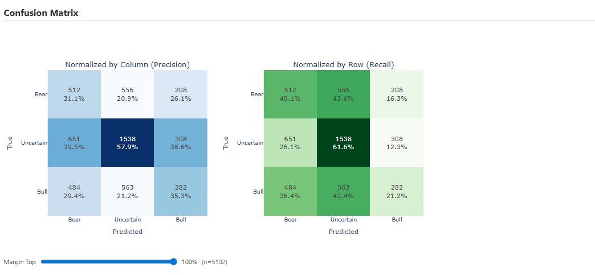
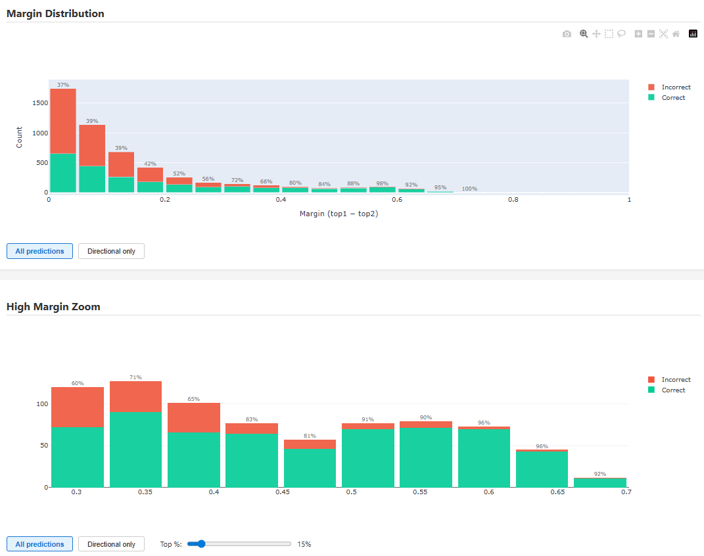
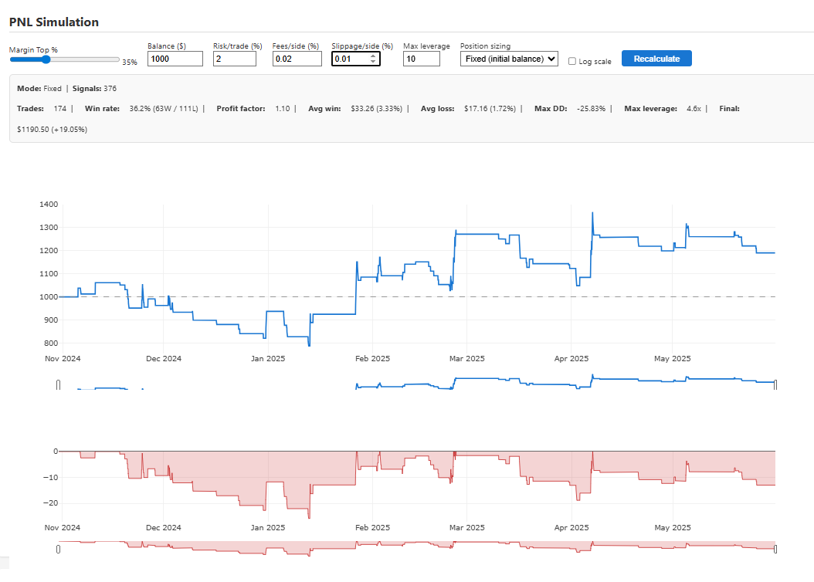
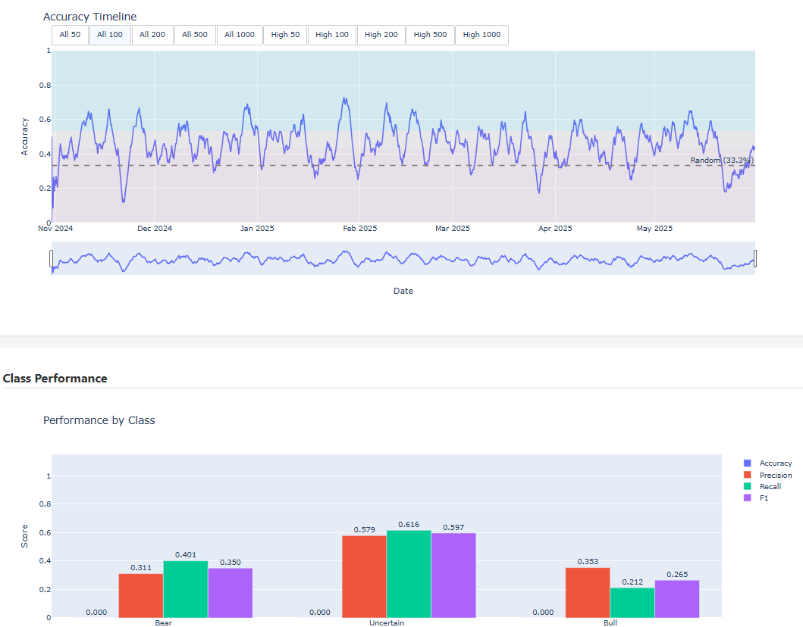

# Daikoku

**Prediction de la direction des marches de cryptomonnaies par deep learning via Mamba (Selective State Space Model)**


*[English version](README.md)*

| TensorBoard | Explorateur de Features | Rapport d'evaluation | Dashboard Live |
|:-:|:-:|:-:|:-:|
|  |  |  |  |

<details>
<summary>Plus de captures d'evaluation</summary>

| Matrice de Confusion | Distribution des Marges |
|:-:|:-:|
|  |  |

| Simulation PNL | Timeline Accuracy |
|:-:|:-:|
|  |  |

</details>

---

## Presentation

Daikoku est un framework end-to-end pour la prediction de la direction des prix de cryptomonnaies. Il couvre le cycle complet : **preparation des donnees**, **entrainement du modele**, **evaluation**, et **inference en direct** — le tout depuis une configuration centralisee unique.

Le modele repose sur l'architecture [Mamba](https://arxiv.org/abs/2312.00752) (Selective State Space Model), offrant un traitement de sequences en temps lineaire comme alternative aux Transformers.

### Modes de prediction

Controle par `PREDICTION_TARGET` dans `config.py` :

| Mode          | Classes | Description                                                                   |
|---------------|---------|-------------------------------------------------------------------------------|
| `triple`      | 3       | **Bull / Bear / Uncertain** — Triple Barrier avec TP/SL dynamiques bases ATR  |
| `bull`        | 2       | Binaire : Bull vs. non-Bull                                                   |
| `bear`        | 2       | Binaire : Bear vs. non-Bear                                                   |
| `uncertain`   | 2       | Binaire : Uncertain vs. directionnel                                          |
| `close1`      | 2       | Binaire : la prochaine bougie cloture plus haut ou plus bas                   |
| `close2`      | 2       | Binaire : prix plus haut ou plus bas apres 2 bougies                          |
| `close3`      | 2       | Binaire : prix plus haut ou plus bas apres 3 bougies                          |

Le mode par defaut `triple` utilise l'etiquetage Triple Barrier avec des niveaux de take-profit et stop-loss dynamiques bases sur l'ATR (multiplicateurs configurables). Chaque prediction definit ainsi un risque fixe par trade (1R = distance au stop-loss), et la performance est evaluee en multiples de R, permettant une allocation constante quelle que soit la volatilite. Les modes `bull`, `bear` et `uncertain` sont des declinaisons binaires du meme etiquetage Triple Barrier.

Les modes `close*` fournissent des cibles directionnelles plus simples sans niveaux TP/SL explicites : le chiffre indique le nombre de bougies dans le futur (1, 2 ou 3) pour determiner si le prix cloture plus haut ou plus bas.

## Fonctionnalites principales

- **Architecture Mamba SSM** — modele causal en espace d'etats avec complexite lineaire, projection d'entree optionnelle double voie (Linear + CNN)
- **Fusion multi-timeframe** — encodeur a double branche traitant deux intervalles de temps simultanement, avec 4 modes d'attention/fusion (off, pre_gate, post_gate, aligned)
- **Etiquetage Triple Barrier** — niveaux dynamiques TP/SL bases sur l'ATR, calcules sur les donnees brutes avant toute transformation (pas de fuite d'information)
- **23 features ingenierees** — log OHLCV, interpolation zigzag, distances S/R structurelles, profil de volume, filtres de regime HMA, encodage cyclique du temps, avec normalisation mediane/IQR par fenetre
- **Optimisation multi-objectifs Optuna** — recherche automatisee d'hyperparametres maximisant la precision directionnelle tout en minimisant le surapprentissage
- **Inference en direct** — prediction en temps reel connectee aux echanges via ccxt, avec suivi de trades virtuels, tableau de bord web et verification de reproductibilite deterministe
- **Evaluation complete** — rapports HTML interactifs, metriques par classe, filtrage haute confiance, analyse d'edge en multiples de R
- **Pas de look-ahead bias** — labels calcules sur donnees brutes avant toute transformation, features par fenetre calculees independamment, architecture causale, verifie par 6 tests dedies (troncature pipeline complet, mutation de donnees futures, isolation multi-TF, scan causal)
- **Repli CPU** — implementation PyTorch pure (`mamba_cpu.py`) avec scan selectif compile JIT lorsque CUDA n'est pas disponible

## Pipeline d'entrainement

```
╔════════════════════════════════════════════════════════════════════╗
║                    1. PREPARATION DES DONNEES                      ║
╠════════════════════════════════════════════════════════════════════╣
║                                                                    ║
║  CSV (OHLCV)                                                       ║
║      │                                                             ║
║      ▼                                                             ║
║  Chargement & Validation                                           ║
║      │                                                             ║
║      ├──────────────────────────────┐                              ║
║      ▼                              ▼                              ║
║  Labels Triple Barrier         Transformation Log                  ║
║  (sur donnees BRUTES)          12 features globales                ║
║  Bear=0 / Uncertain=1 / Bull=2                                     ║
║                                                                    ║
╠════════════════════════════════════════════════════════════════════╣
║                         2. FENETRAGE                               ║
╠════════════════════════════════════════════════════════════════════╣
║                                                                    ║
║  Fenetres glissantes (WINDOW_SIZE bougies)                         ║
║      │                                                             ║
║      ▼                                                             ║
║  Features par fenetre (zigzag + 5 structurelles)                   ║
║      │                                                             ║
║      ▼                                                             ║
║  Normalisation Mediane/IQR (7 premieres features)                  ║
║      │                                                             ║
║      ▼                                                             ║
║  23 features par fenetre                                           ║
║                                                                    ║
╠════════════════════════════════════════════════════════════════════╣
║                 3. MULTI-TIMEFRAME (optionnel)                     ║
╠════════════════════════════════════════════════════════════════════╣
║                                                                    ║
║  ┌─────────────────────┐         ┌──────────────────────────┐      ║
║  │  Branche Primaire   │         │  Branche Secondaire      │      ║
║  │  23 feat (avec time)│         │  19 feat (sans time)     │      ║
║  │  TF original (1h)   │         │  TF agrege (4h)          │      ║
║  └────────┬────────────┘         └────────────┬─────────────┘      ║
║           │                                   │                    ║
║           ▼                                   ▼                    ║
╠════════════════════════════════════════════════════════════════════╣
║                          4. MODELE                                 ║
╠════════════════════════════════════════════════════════════════════╣
║                                                                    ║
║  ┌─────────────────────┐         ┌──────────────────────────┐      ║
║  │  Projection Entree  │         │  Projection Entree       │      ║
║  │  Linear (+CNN opt.) │         │  Linear                  │      ║
║  └────────┬────────────┘         └────────────┬─────────────┘      ║
║           │                                   │                    ║
║           ▼                                   ▼                    ║
║  ┌─────────────────────┐         ┌──────────────────────────┐      ║
║  │  Encodeur Mamba     │         │  Encodeur Mamba          │      ║
║  │  N_LAYERS blocs     │         │  MTF_N_LAYERS blocs      │      ║
║  │  (SSM causal)       │         │  (SSM causal)            │      ║
║  └────────┬────────────┘         └────────────┬─────────────┘      ║
║           │                                   │                    ║
║           └──────────────┬────────────────────┘                    ║
║                          │                                         ║
║                          ▼                                         ║
╠════════════════════════════════════════════════════════════════════╣
║                     5. FUSION & TETE                               ║
╠════════════════════════════════════════════════════════════════════╣
║                                                                    ║
║                    Mode d'attention ?                              ║
║                          │                                         ║
║       ┌──────┬───────────┼───────────┐                             ║
║       ▼      ▼           ▼           ▼                             ║
║     off   pre_gate   post_gate   aligned                           ║
║       │      │           │           │                             ║
║       ▼      ▼           ▼           ▼                             ║
║    Unified  Unified   Unified   AlignedFusion                      ║
║    Head     Head      Head      (gated residual)                   ║
║    2 paths  4 paths   3 paths   → tete MLP                         ║
║             +SelfAttn +CrossAttn                                   ║
║       │      │           │           │                             ║
║       └──────┴───────────┴───────────┘                             ║
║                          │                                         ║
║                          ▼                                         ║
║                  Logits (batch, 3)                                 ║
║                  Bear / Uncertain / Bull                           ║
║                                                                    ║
╠════════════════════════════════════════════════════════════════════╣
║                      6. ENTRAINEMENT                               ║
╠════════════════════════════════════════════════════════════════════╣
║                                                                    ║
║  Logits ──► UnifiedLoss (Focal + Class Weights) ◄── Labels         ║
║                          │                                         ║
║                          ▼                                         ║
║              AdamW + LR Scheduler (cosine/wsd)                     ║
║                          │                                         ║
║                          ▼                                         ║
║              Checkpoint (meilleure balanced_accuracy)              ║
║                                                                    ║
╚════════════════════════════════════════════════════════════════════╝
```

## Demarrage rapide

```bash
# 1. Cloner
git clone https://github.com/yannpointud/Daikoku.git
cd Daikoku

# 2. Installer (CUDA 12.4 requis)
pip install torch==2.4.1 --index-url https://download.pytorch.org/whl/cu124
pip install -r requirements.txt
pip install mamba-ssm==2.3.0 causal-conv1d==1.5.2

# 3. Telecharger des donnees
python modules/tools/download_candles.py --exchange binance --pair BTC/USDT --timeframe 1h --start 2020-01-01 --output data/BTC_1h_bin.csv

# 4. Entrainer
python main.py

# 5. Evaluer
python evaluate.py

# 6. Surveiller
tensorboard --logdir runs/
```

Tous les parametres sont configures dans un fichier unique : `config.py`. Pour les instructions detaillees d'installation, les options de configuration et tous les modes operationnels, voir le **[Guide d'utilisation](docs/Guide_FR.md)**.

## Modes operationnels

- **`main.py`** — Entraine le modele sur les donnees historiques configurees. Produit un checkpoint (`models/best_model.pt`) et des metriques TensorBoard.
- **`optimize.py`** — Recherche automatisee d'hyperparametres via Optuna (multi-objectifs). Chaque trial entraine un modele complet et les resultats sont compares pour trouver la meilleure configuration.
- **`evaluate.py`** — Evalue un checkpoint sur n'importe quel dataset (y compris des donnees jamais vues a l'entrainement) et genere un rapport HTML interactif avec metriques par classe, analyse de confiance et edge en multiples de R.
- **`inference.py`** — Connecte le modele a un echange en temps reel via ccxt pour verifier ses predictions sur des donnees live, avec suivi de trades virtuels et tableau de bord web.

## Structure du projet

```
Daikoku/
├── main.py          # Pipeline d'entrainement
├── evaluate.py      # Evaluation hors ligne avec rapports HTML
├── inference.py     # Inference en direct avec flux d'echange et tableau de bord web
├── optimize.py      # Recherche multi-objectifs d'hyperparametres (Optuna)
├── config.py        # Source unique de verite pour tous les parametres
│
├── modules/
│   ├── model/       # Architecture Mamba (GPU + repli CPU)
│   ├── data/        # Chargement, etiquetage, transformation, dataset, multi-TF
│   ├── training/    # Trainer, perte, metriques, surveillance
│   ├── inference/   # Moteur de prediction, flux d'echange, tracker de trades, dashboard
│   └── evaluation/  # Evaluateur de modele, generation de rapports HTML
│
└── tests/           # Suite de tests (pytest)
    └── data/        # Jeu de donnees de test (inclus)
```

Pour le detail complet de l'architecture (modele, pipeline de donnees, systeme d'entrainement, metriques, inference live), voir **[Architecture_FR.md](docs/Architecture_FR.md)**.

## Documentation

| Document                                             | Description                                            |
|------------------------------------------------------|--------------------------------------------------------|
| [Architecture](docs/Architecture_FR.md)              | Architecture technique — modele, pipeline, entrainement |
| [Guide](docs/Guide_FR.md)                            | Installation, configuration, tous les modes             |
| [Metriques TB](docs/Metrics_TB_FR.md)                | Reference des metriques TensorBoard (100+)              |
| [Contribuer](CONTRIBUTING_FR.md)                     | Comment contribuer                                      |

## Stack technique

Python 3.11 · PyTorch 2.4.1 · Mamba SSM · CUDA 12.4 · Optuna · ccxt · TensorBoard · Plotly

## Avertissement

**Ce logiciel est destine a un usage educatif et de recherche uniquement. Il ne constitue pas un conseil en investissement.**

- Le trading de cryptomonnaies comporte un **risque substantiel de perte** — vous pouvez perdre tout ou partie de votre capital
- Les performances passees ne **garantissent pas** les resultats futurs
- Les modeles de machine learning peuvent et vont produire des predictions incorrectes
- Les auteurs n'assument **aucune responsabilite** pour les decisions de trading ou les pertes financieres
- **Utilisation a vos risques et perils**

Pour l'avertissement complet, voir **[DISCLAIMER_FR.md](docs/DISCLAIMER_FR.md)**.

## Licence

[MIT](LICENSE)
