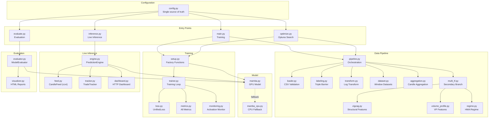
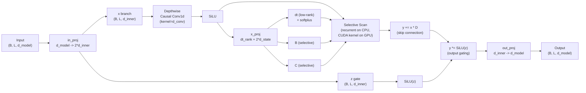
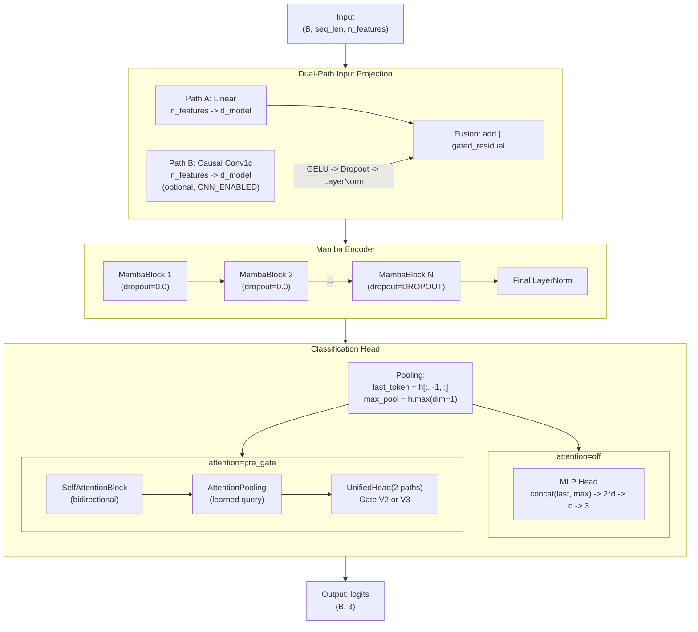
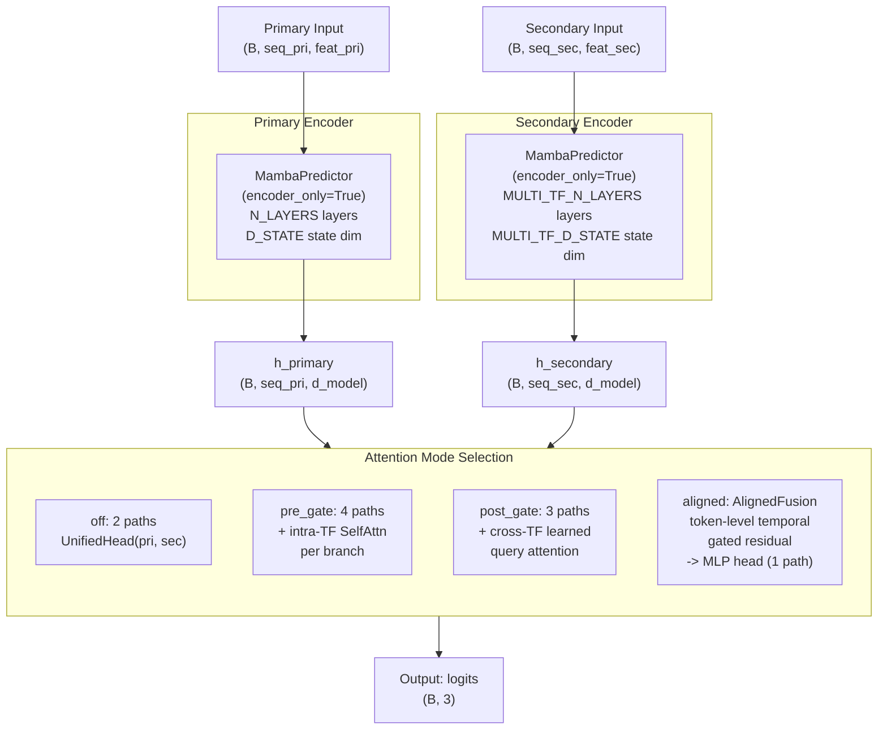
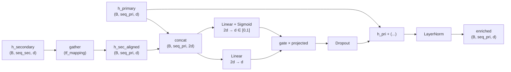
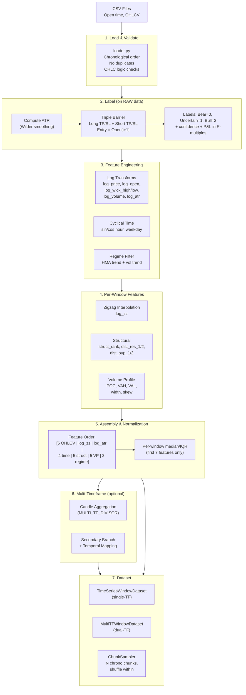
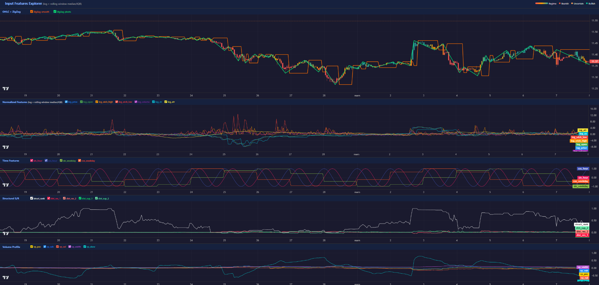
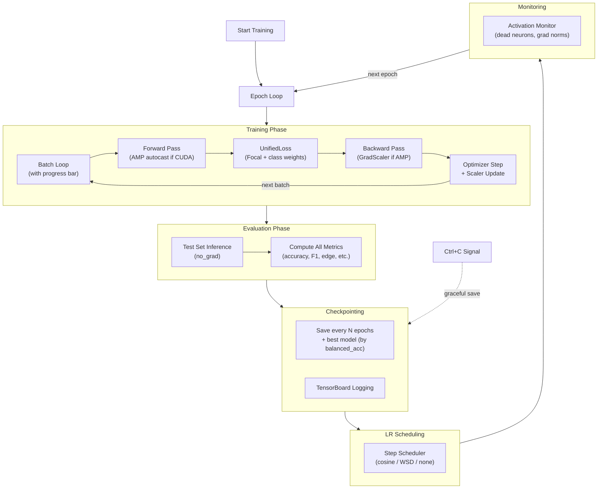
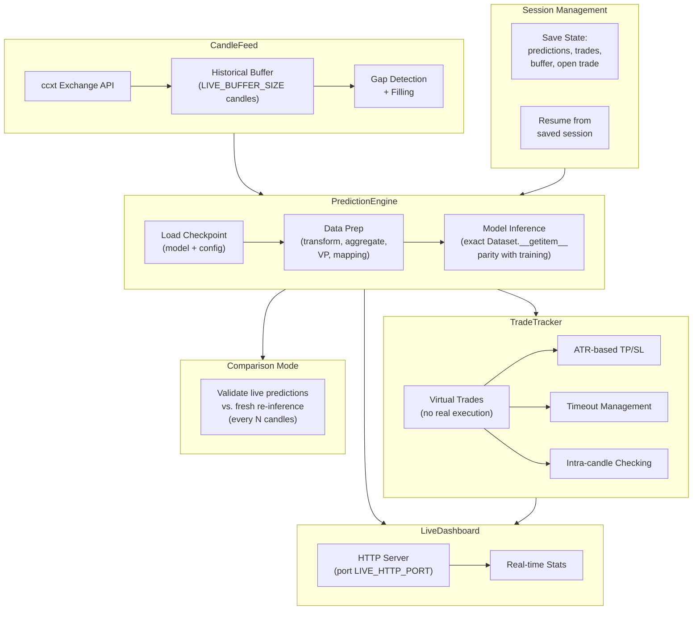

# Daikoku -- Technical Architecture Document

*[Version francaise](Architecture_FR.md)*

> Cryptocurrency trading prediction system built on the Mamba (Selective State Space Model) architecture.
> 3-class market direction classification: **Bull / Bear / Uncertain** using Triple Barrier labeling on OHLCV candlestick data.

---

## Training Pipeline Overview

```
╔════════════════════════════════════════════════════════════════════╗
║                        1. DATA PREPARATION                         ║
╠════════════════════════════════════════════════════════════════════╣
║                                                                    ║
║  CSV (OHLCV)                                                       ║
║      │                                                             ║
║      ▼                                                             ║
║  Load & Validate                                                   ║
║      │                                                             ║
║      ├──────────────────────────────┐                              ║
║      ▼                              ▼                              ║
║  Triple Barrier Labels         Log Transform                       ║
║  (on RAW data)                 12 global features                  ║
║  Bear=0 / Uncertain=1 / Bull=2                                     ║
║                                                                    ║
╠════════════════════════════════════════════════════════════════════╣
║                          2. WINDOWING                              ║
╠════════════════════════════════════════════════════════════════════╣
║                                                                    ║
║  Sliding Windows (WINDOW_SIZE candles)                             ║
║      │                                                             ║
║      ▼                                                             ║
║  Per-Window Features (zigzag + 5 structural)                       ║
║      │                                                             ║
║      ▼                                                             ║
║  Median/IQR Normalization (first 7 features)                       ║
║      │                                                             ║
║      ▼                                                             ║
║  23 features per window                                            ║
║                                                                    ║
╠════════════════════════════════════════════════════════════════════╣
║                   3. MULTI-TIMEFRAME (optional)                    ║
╠════════════════════════════════════════════════════════════════════╣
║                                                                    ║
║  ┌─────────────────────┐         ┌──────────────────────────┐      ║
║  │  Primary Branch     │         │  Secondary Branch        │      ║
║  │  23 feat (with time)│         │  19 feat (no time)       │      ║
║  │  original TF (1h)   │         │  aggregated TF (4h)      │      ║
║  └────────┬────────────┘         └────────────┬─────────────┘      ║
║           │                                   │                    ║
║           ▼                                   ▼                    ║
╠════════════════════════════════════════════════════════════════════╣
║                           4. MODEL                                 ║
╠════════════════════════════════════════════════════════════════════╣
║                                                                    ║
║  ┌─────────────────────┐         ┌──────────────────────────┐      ║
║  │  Input Projection   │         │  Input Projection        │      ║
║  │  Linear (+CNN opt.) │         │  Linear                  │      ║
║  └────────┬────────────┘         └────────────┬─────────────┘      ║
║           │                                   │                    ║
║           ▼                                   ▼                    ║
║  ┌─────────────────────┐         ┌──────────────────────────┐      ║
║  │  Mamba Encoder      │         │  Mamba Encoder           │      ║
║  │  N_LAYERS blocks    │         │  MTF_N_LAYERS blocks     │      ║
║  │  (causal SSM)       │         │  (causal SSM)            │      ║
║  └────────┬────────────┘         └────────────┬─────────────┘      ║
║           │                                   │                    ║
║           └──────────────┬────────────────────┘                    ║
║                          │                                         ║
║                          ▼                                         ║
╠════════════════════════════════════════════════════════════════════╣
║                     5. FUSION & HEAD                               ║
╠════════════════════════════════════════════════════════════════════╣
║                                                                    ║
║                    Attention Mode ?                                ║
║                          │                                         ║
║       ┌──────┬───────────┼───────────┐                             ║
║       ▼      ▼           ▼           ▼                             ║
║     off   pre_gate   post_gate   aligned                           ║
║       │      │           │           │                             ║
║       ▼      ▼           ▼           ▼                             ║
║    Unified  Unified   Unified   AlignedFusion                      ║
║    Head     Head      Head      (gated residual)                   ║
║    2 paths  4 paths   3 paths   → MLP head                         ║
║             +SelfAttn +CrossAttn                                   ║
║       │      │           │           │                             ║
║       └──────┴───────────┴───────────┘                             ║
║                          │                                         ║
║                          ▼                                         ║
║                  Logits (batch, 3)                                 ║
║                  Bear / Uncertain / Bull                           ║
║                                                                    ║
╠════════════════════════════════════════════════════════════════════╣
║                        6. TRAINING                                 ║
╠════════════════════════════════════════════════════════════════════╣
║                                                                    ║
║  Logits ──► UnifiedLoss (Focal + Class Weights) ◄── Labels         ║
║                          │                                         ║
║                          ▼                                         ║
║              AdamW + LR Scheduler (cosine/wsd)                     ║
║                          │                                         ║
║                          ▼                                         ║
║              Checkpoint (best balanced_accuracy)                   ║
║                                                                    ║
╚════════════════════════════════════════════════════════════════════╝
```

---

## Table of Contents

1. [System Overview](#system-overview)
2. [Project Structure](#project-structure)
3. [High-Level Architecture](#high-level-architecture)
4. [Model Architecture](#model-architecture)
   - [Mamba SSM Core](#mamba-ssm-core)
   - [CPU Fallback Mechanism](#cpu-fallback-mechanism)
   - [MambaBlock](#mambablock)
   - [MambaPredictor (Single-Timeframe)](#mambapredictor-single-timeframe)
   - [MultiTFMambaPredictor (Multi-Timeframe)](#multitfmambapredictor-multi-timeframe)
   - [AlignedFusion](#alignedfusion)
   - [UnifiedHead](#unifiedhead)
   - [Attention Components](#attention-components)
5. [Data Pipeline](#data-pipeline)
   - [CSV Ingestion and Validation](#csv-ingestion-and-validation)
   - [Triple Barrier Labeling](#triple-barrier-labeling)
   - [Feature Engineering](#feature-engineering)
   - [Normalization](#normalization)
   - [Multi-Timeframe Modes](#multi-timeframe-modes)
   - [Dataset and Sampling](#dataset-and-sampling)
6. [Training System](#training-system)
   - [Training Loop](#training-loop)
   - [Cascade Training](#cascade-training)
   - [Loss Function](#loss-function)
   - [Optimizer and LR Scheduling](#optimizer-and-lr-scheduling)
   - [Metrics](#metrics)
   - [Activation Monitoring](#activation-monitoring)
7. [Evaluation System](#evaluation-system)
8. [Live Inference System](#live-inference-system)
9. [Hyperparameter Optimization](#hyperparameter-optimization)
10. [Configuration](#configuration)
11. [Dependencies](#dependencies)

---

## System Overview

Daikoku is a prediction system designed for cryptocurrency markets. It predicts the short-term directional outcome of price action using a classification approach with three classes:

| Class | Label     | Meaning                                     |
|-------|-----------|---------------------------------------------|
| 0     | Bear      | Short take-profit hit before stop-loss      |
| 1     | Uncertain | Neither barrier hit within the time horizon |
| 2     | Bull      | Long take-profit hit before stop-loss       |

The system supports four operational modes:

| Mode               | Entry Point    | Description                                                                |
|--------------------|----------------|----------------------------------------------------------------------------|
| **Training**       | `main.py`      | Model training with checkpointing, TensorBoard logging, and AMP            |
| **Evaluation**     | `evaluate.py`  | Offline evaluation with HTML reports and metric analysis                   |
| **Live Inference** | `inference.py` | Real-time prediction with exchange feed, trade tracking, and web dashboard |
| **Optimization**   | `optimize.py`  | Multi-objective hyperparameter search via Optuna                           |

---

## Project Structure

```
Daikoku/
├── main.py                        # Training entry point
├── evaluate.py                    # Evaluation entry point
├── inference.py                   # Live inference entry point
├── optimize.py                    # Optuna HP optimization entry point
├── config.py                      # Single source of all configuration parameters
│
├── modules/
│   ├── model/
│   │   ├── mamba.py               # GPU model: MambaBlock, SelfAttention, AlignedFusion,
│   │   │                          #   UnifiedHead, MambaPredictor, MultiTFMambaPredictor
│   │   └── mamba_cpu.py           # Pure PyTorch CPU fallback (drop-in Mamba replacement)
│   │
│   ├── data/
│   │   ├── loader.py              # CSV loading and validation
│   │   ├── labeling.py            # Triple Barrier labeling + next-close labels
│   │   ├── transform.py           # Log transformation, normalization pipeline
│   │   ├── dataset.py             # TimeSeriesWindowDataset, MultiTFWindowDataset, ChunkSampler
│   │   ├── pipeline.py            # Complete preprocessing orchestration (off/calibration/dual)
│   │   ├── aggregation.py         # Candle aggregation for multi-timeframe
│   │   ├── multi_tf.py            # Secondary branch building + VP computation
│   │   ├── zigzag.py              # Zigzag interpolation + structural features
│   │   ├── volume_profile.py      # Volume profile features (POC, VAH, VAL, width, skew)
│   │   ├── regime.py              # HMA-based market regime filter
│   │   └── partial_context.py     # Partial secondary candle recomputation
│   │
│   ├── training/
│   │   ├── trainer.py             # Trainer class with AMP, cascade, scheduling
│   │   ├── loss.py                # UnifiedLoss (Focal + class weighting)
│   │   ├── metrics.py             # Accuracy, F1, edge, highconf, margin, overfitting gaps
│   │   ├── monitoring.py          # Activation monitoring, dead neuron detection
│   │   └── setup.py               # Factory functions: create_model, create_optimizer, etc.
│   │
│   ├── inference/
│   │   ├── engine.py              # PredictionEngine (off/calibration/dual inference)
│   │   ├── feed.py                # CandleFeed (exchange candle fetching via ccxt)
│   │   ├── tracker.py             # TradeTracker (virtual trade management)
│   │   └── dashboard.py           # LiveDashboard (HTTP server)
│   │
│   ├── evaluation/
│   │   ├── evaluator.py           # ModelEvaluator
│   │   ├── visualizer.py          # HTML report generation (predictions on price chart)
│   │   ├── visualize_interactive.py  # Input feature visualization
│   │   ├── visualize_regime.py    # Regime filter visualization
│   │   └── visualize_zigzag.py    # Zigzag and structural feature visualization
│   │
│   ├── tools/
│   │   ├── download_candles.py    # OHLCV data downloader (ccxt)
│   │   ├── augment_data.py        # Data augmentation (OU process)
│   │   ├── visualize_augment.py   # Side-by-side original vs augmented charts
│   │   ├── analyze_labels.py      # Label distribution analysis
│   │   ├── extract_metrics.py     # TensorBoard metrics extraction and analysis
│   │   ├── eval_per_file.py       # Per-file independent evaluation
│   │   ├── run_training.sh        # Training launcher with process protection
│   │   ├── xgboost_baseline.py    # XGBoost baseline comparison
│   │   ├── mlp_cascade_baseline.py # MLP cascade baseline comparison
│   │   └── tsne_analysis.py       # t-SNE embedding analysis
│   │
│   └── utils/
│       ├── logger.py              # Logging setup
│       └── seed.py                # Reproducibility seed
│
└── tests/                         # Comprehensive test suite
    └── data/
        └── test_Dataset.csv       # Test dataset (committed, used by all tests)
```

---

## High-Level Architecture



---

## Model Architecture

### Mamba SSM Core

The Mamba Selective State Space Model implements discretized state equations that process sequences causally. Unlike Transformers, Mamba achieves linear-time complexity by replacing attention with a recurrent state-space formulation that selectively filters information.

**Discretized State Equations:**

```
h_t = exp(dt * A) * h_{t-1} + dt * B * x_t
y_t = (h_t * C).sum(dim=-1)
```

| Parameter | Shape                       | Description                                                  |
|-----------|-----------------------------|--------------------------------------------------------------|
| `A`       | `(d_inner, d_state)`        | State transition matrix, initialized as log-space HiPPO      |
| `B`       | `(batch, seq_len, d_state)` | Input-dependent projection (selective)                       |
| `C`       | `(batch, seq_len, d_state)` | Output-dependent projection (selective)                      |
| `D`       | `(d_inner,)`                | Skip connection scalar per inner dimension                   |
| `dt`      | `(batch, seq_len, d_inner)` | Discretization step sizes via low-rank projection + softplus |

**Mamba Block Internal Flow:**



### CPU Fallback Mechanism

The system automatically detects whether the CUDA `mamba_ssm` package is available and falls back to a pure PyTorch implementation when it is not.

```python
# In mamba.py — 4-case detection:
try:
    from mamba_ssm import Mamba as _MambaGPU
    _HAS_CUDA_MAMBA = True
except ImportError:
    _HAS_CUDA_MAMBA = False

_force_cpu = getattr(config, 'DEVICE', 'auto').lower() == 'cpu'

if not _HAS_CUDA_MAMBA:
    from modules.model.mamba_cpu import Mamba       # Case 1: mamba_ssm not installed
elif not torch.cuda.is_available():
    from modules.model.mamba_cpu import Mamba       # Case 2: no CUDA GPU detected
elif _force_cpu:
    from modules.model.mamba_cpu import Mamba       # Case 3: DEVICE='cpu' in config
else:
    Mamba = _MambaGPU                               # Case 4: normal GPU mode
```

Each fallback case logs a specific warning explaining why the CPU implementation is used.

The CPU implementation (`mamba_cpu.py`, ~200 lines) provides an **identical interface** to the CUDA version. The key difference is in the selective scan operation:

| Aspect         | GPU (`mamba_ssm`)                                    | CPU (`mamba_cpu.py`)                                          |
|----------------|------------------------------------------------------|---------------------------------------------------------------|
| Scan method    | Fused CUDA kernel (parallel)                         | JIT-compiled `@torch.jit.script` recurrent scan               |
| Performance    | Fast (optimized for GPU)                             | Extremely slower (sequential scan, multi-threaded tensor ops) |
| Interface      | `Mamba(d_model, d_state, d_conv, expand)`            | Identical                                                     |
| I/O shapes     | `(B, L, d_model) -> (B, L, d_model)`                 | Identical                                                     |
| Parameters     | A_log, D, in_proj, conv1d, x_proj, dt_proj, out_proj | Identical                                                     |
| Initialization | HiPPO for A, ones for D                              | Identical                                                     |

The CPU selective scan is JIT-compiled via `@torch.jit.script` for performance:

```python
@torch.jit.script
def _selective_scan_jit(x, dt, A, B, C):
    y = torch.zeros_like(x)
    h = torch.zeros(batch, d_inner, d_state, ...)
    for t in range(seq_len):
        dt_t = dt[:, t, :].unsqueeze(-1)                     # (B, d_inner, 1)
        dA = torch.exp(dt_t * A)                              # (B, d_inner, d_state)
        dB = dt_t * B[:, t, :].unsqueeze(1)                   # (B, d_inner, d_state)
        h = dA * h + dB * x[:, t, :].unsqueeze(-1)            # (B, d_inner, d_state)
        y[:, t, :] = (h * C[:, t, :].unsqueeze(1)).sum(-1)    # (B, d_inner)
    return y
```

### MambaBlock

Pre-norm residual block wrapping a single Mamba layer:

```
Input (B, L, d_model)
  |
  +---> LayerNorm --> Mamba --> Dropout --> (+) --> Output (B, L, d_model)
  |                                         ^
  +------------- residual -----------------+
```

- LayerNorm is configurable via `MAMBA_LAYERNORM` (defaults to `nn.Identity` when disabled).
- Dropout is only applied to the **last N layers** (controlled by `DROPOUT_LAST_N_LAYERS`). Earlier layers get `dropout=0.0`.

### MambaPredictor (Single-Timeframe)

The primary model for single-timeframe prediction. Can also serve as an encoder-only backbone for multi-timeframe setups.



**Tensor shape trace (attention=off, d_model=48, seq_len=120, 23 features):**

| Stage                   | Shape          |
|-------------------------|----------------|
| Input                   | `(B, 120, 23)` |
| After linear projection | `(B, 120, 48)` |
| After N MambaBlocks     | `(B, 120, 48)` |
| last_token              | `(B, 48)`      |
| max_pool                | `(B, 48)`      |
| concat(last, max)       | `(B, 96)`      |
| After MLP head          | `(B, 3)`       |

### MultiTFMambaPredictor (Multi-Timeframe)

Dual-branch architecture with independent encoders for primary and secondary timeframes.



**Attention mode details:**

| Mode        | Paths | Head                        | Description                                                                                                |
|-------------|-------|-----------------------------|------------------------------------------------------------------------------------------------------------|
| `off`       | 2     | [UnifiedHead](#unifiedhead) | Standard pooling of both branches                                                                          |
| `pre_gate`  | 4     | [UnifiedHead](#unifiedhead) | + Intra-TF [SelfAttention](#attention-components) per branch                                               |
| `post_gate` | 3     | [UnifiedHead](#unifiedhead) | + Cross-TF learned query attention on concatenated sequences                                               |
| `aligned`   | 1     | MLP                         | [AlignedFusion](#alignedfusion) injects secondary into primary via gated residual; no separate gate needed |

### AlignedFusion

Temporally aligned cross-timeframe fusion module. For each primary token, it gathers the corresponding secondary token using a precomputed temporal mapping, then applies a gated residual connection.



**Pseudocode:**

```
h_sec_aligned = gather(h_sec, tf_mapping)         # (B, seq_pri, d_model)
combined = concat(h_pri, h_sec_aligned)            # (B, seq_pri, 2*d_model)
gate = sigmoid(Linear(combined))                   # (B, seq_pri, d_model) in [0, 1]
projected = Linear(combined)                       # (B, seq_pri, d_model)
enriched = LayerNorm(h_pri + dropout(gate * projected))  # (B, seq_pri, d_model)
```

The gate learns per-position and per-feature how much secondary context to inject. Since secondary information is already fused into the primary representation, the classification head only needs a single path (no [Gate/UnifiedHead](#unifiedhead)), avoiding gate collapse.

### UnifiedHead

Configurable classification head that receives a list of `(last_token, max_pool)` tuples -- one per active path.

**V2 (Scalar Gate):**

```
For each path i:  agg_i = last_i + max_i                     -> (B, d_model)
Context:          concat(last_0, max_0, ..., last_n, max_n)   -> (B, n_paths * 2 * d_model)
Gate:             Linear -> Tanh -> Linear -> Softmax          -> (B, n_paths) scalars
Fusion:           concat(agg_i * weight_i for all i)           -> (B, n_paths * d_model)
Classifier:       Linear -> GELU -> Dropout -> Linear          -> (B, num_classes)
```

**V3 (MLP Per-Feature Gate):**

```
For each path i:  proj_i = Linear(concat(last_i, max_i))      -> (B, d_model)
Gate input:       concat(proj_0, ..., proj_n)                  -> (B, n_paths * d_model)
Gate MLP:         Linear -> ReLU -> Linear -> Sigmoid          -> (B, n_paths * d_model)
Fusion:           sum(proj_i * gate_i for all i)               -> (B, d_model)
Classifier:       Linear -> GELU -> Dropout -> Linear          -> (B, num_classes)
```

The V3 gate uses a bottleneck architecture (`GATE_BOTTLENECK`) to reduce parameter count while maintaining per-feature granularity.

### Attention Components

**SelfAttentionBlock:**
- Wraps `nn.MultiheadAttention` with `batch_first=True`
- Bidirectional (no causal mask) -- complements the causal Mamba encoder
- FlashAttention enabled automatically on PyTorch 2.0+
- Used as a parallel branch alongside Mamba, not as a replacement

**AttentionPooling:**
- Learned query-based pooling: `(B, seq_len, d_model) -> (B, d_model)`
- Single learnable query vector, dot-product with sequence, softmax-weighted sum
- Used to pool attention branch outputs into fixed-size representations

---

## Data Pipeline



### CSV Ingestion and Validation

Required columns: `Open time, Open, High, Low, Close, Volume`

Validation rules enforced by `loader.py`:
- Chronological ordering (monotonically increasing timestamps)
- No duplicate timestamps
- OHLC logic: `High >= max(Open, Close)`, `Low <= min(Open, Close)`, `High >= Low`
- Non-negative volume

### Triple Barrier Labeling

Labeling is performed on **raw** (untransformed) data to ensure price relationships are preserved (see [Feature Engineering](#feature-engineering) for the subsequent transform step).

For each candle `i`:
1. **Entry price** = `Open[i+1]` (realistic: signal at `Close[i]`, execute at next `Open`)
2. **Long scenario**: TP = entry + `ATR_MULTIPLIER_TP` x ATR, SL = entry - `ATR_MULTIPLIER_SL` x ATR
3. **Short scenario**: TP = entry - `ATR_MULTIPLIER_TP` x ATR, SL = entry + `ATR_MULTIPLIER_SL` x ATR
4. Evaluate over next `MAX_HORIZON` candles to see which barrier is hit first

| Outcome            | Label     | Value |
|--------------------|-----------|-------|
| Long TP hit first  | Bull      | 2     |
| Short TP hit first | Bear      | 0     |
| Neither TP hit     | Uncertain | 1     |

Additional outputs per sample:
- **Confidence**: `1 - (hit_candle / max_horizon)`, with optional `sqrt` curve for gentler decay
- **P&L in R-multiples**: tracked for edge metrics during evaluation

The system also supports binary next-close labels (`close1`, `close2`, `close3` targets) for simpler directional prediction.

### Feature Engineering

The feature set contains **23 features**:

**Global features (12, computed in `transform_pipeline`):**

| Index | Feature                      | Type          | Normalization             |
|-------|------------------------------|---------------|---------------------------|
| 0     | `log_price`                  | OHLCV         | Per-window median/IQR     |
| 1     | `log_open`                   | OHLCV         | Per-window median/IQR     |
| 2     | `log_wick_high`              | OHLCV         | Per-window median/IQR     |
| 3     | `log_wick_low`               | OHLCV         | Per-window median/IQR     |
| 4     | `log_volume`                 | OHLCV         | Per-window median/IQR     |
| 5     | `log_atr`                    | Volatility    | Per-window median/IQR     |
| 6-7   | `sin_hour`, `cos_hour`       | Cyclical time | None (bounded [-1, 1])    |
| 8-9   | `sin_weekday`, `cos_weekday` | Cyclical time | None (bounded [-1, 1])    |
| 10    | `regime_trend`               | HMA regime    | None (scaled to [-1, +1]) |
| 11    | `regime_voltrend`            | HMA regime    | None (scaled to [-1, +1]) |

**Per-window features (6, computed in `Dataset.__getitem__` to prevent look-ahead):**

| Feature                      | Type                 | Normalization         |
|------------------------------|----------------------|-----------------------|
| `log_zz` (inserted at col 5) | Zigzag interpolation | Per-window median/IQR |
| `struct_rank`                | Structural           | None                  |
| `dist_res_1`, `dist_res_2`   | Resistance distances | None                  |
| `dist_sup_1`, `dist_sup_2`   | Support distances    | None                  |

**Volume Profile features (5):**

| Feature    | Description                                   |
|------------|-----------------------------------------------|
| `vp_poc`   | Point of Control (highest-volume price level) |
| `vp_vah`   | Value Area High                               |
| `vp_val`   | Value Area Low                                |
| `vp_width` | Value Area width                              |
| `vp_skew`  | Volume distribution skew                      |

**Final assembly order:**

```
Primary branch (23 features):
  [5 OHLCV | log_zz | log_atr | 4 time | 5 struct | 5 VP  | 2 regime]
     0-4       5        6       7-10      11-15     16-20    21-22

Secondary branch (no time features — 19):
  [5 OHLCV | log_zz | log_atr | 5 struct | 5 VP  | 2 regime]
     0-4       5        6        7-11      12-16    17-18
```



### Normalization

Per-window robust normalization is applied only to the **first 7 features** (5 OHLCV + log_zz + log_atr), using median and IQR (interquartile range) for outlier robustness:

```
median = window_feature.median()
IQR = Q75 - Q25
feature_normalized = (feature - median) / (IQR + epsilon)
```

Time features (cyclical sin/cos) and regime features are already bounded and are **not** normalized. Structural features are relative by construction.

### ATR-Relative Scaling

Distance features are expressed in **ATR units** for cross-regime comparability. During window assembly, an ATR/Close ratio is computed from `log_atr` and `log_price`:

```
scaling_ratio = exp(log_atr - log_price)    # (window_size, 1)
```

The following features are divided by this ratio:
- **Structural** columns 1-4 (`dist_res_1`, `dist_res_2`, `dist_sup_1`, `dist_sup_2`) — `struct_rank` (col 0) is NOT scaled
- **Volume Profile** columns 0-3 (`vp_poc`, `vp_vah`, `vp_val`, `vp_width`) — `vp_skew` (col 4) is NOT scaled

In `dual` mode, the secondary branch reuses the **primary branch's** ATR/Close ratio for consistent scaling across timeframes.

### Multi-Timeframe Modes

| Mode          | Description                                                                                                                                            |
|---------------|--------------------------------------------------------------------------------------------------------------------------------------------------------|
| `off`         | Standard single-timeframe pipeline. Uses `TimeSeriesWindowDataset`.                                                                                    |
| `calibration` | Aggregates primary candles by `MULTI_TF_DIVISOR` and runs a single branch on the aggregated data. Used to test the secondary branch in isolation.      |
| `dual`        | Primary + secondary branches with temporal mapping. Uses `MultiTFWindowDataset`. Secondary candles are aggregated from primary via `MULTI_TF_DIVISOR`. |

In `dual` mode:
- Primary: original timeframe candles (e.g., 1h) — **23 features** (with time)
- Secondary: aggregated candles (e.g., 4h when `MULTI_TF_DIVISOR=4`) — **19 features** (time features stripped, as intra-day cyclical encoding is meaningless on aggregated candles)
- Alignment: `"structured"` (hourly boundaries) or `"unstructured"` (consecutive blocks)
- `CROSS_TF_NORMALIZE`: optionally normalize secondary branch using primary branch's median/IQR statistics
- Temporal mapping: integer tensor `(B, seq_pri)` mapping each primary position to its corresponding secondary position
- Partial context: `partial_context.py` pre-computes HMA/ATR intermediates on the complete aggregated data, enabling realistic simulation of incomplete secondary candles during live inference (no look-ahead bias)

### Dataset and Sampling

**TimeSeriesWindowDataset:**
- Sliding windows of `WINDOW_SIZE` candles
- **Label = last candle of the window**: window `[T, T+199]` predicts the future after candle `T+199` (not `T`)
- `__getitem__` computes per-window features (zigzag, structural) and normalization to prevent look-ahead bias
- Returns `(window, label)` or `(window, label, confidence)`

**MultiTFWindowDataset:**
- Extends TimeSeriesWindowDataset for dual-branch operation
- Returns `(window_pri, window_sec, tf_mapping, label)` or with confidence

**ChunkSampler:**
- Splits training indices into N chronological chunks (`SHUFFLE_CHUNKS`)
- Shuffles samples within each chunk
- Preserves local temporal structure while adding stochasticity across the epoch
- `SHUFFLE_CHUNKS=1` degenerates to full random shuffle

---

## Training System

### Training Loop



Key features:
- **AMP mixed precision**: `torch.amp.autocast` + `GradScaler` (CUDA only)
- **Non-blocking GPU transfers**: overlapping CPU/GPU data movement
- **Signal handler**: graceful Ctrl+C saves the current checkpoint before exiting
- **Intra-epoch progress bar** with ETA
- **Best model tracking** by `balanced_accuracy` on test set

### Cascade Training

Progressive layer growing with freezing, activated via `CASCADE_TRAINING=True`:

| Epoch | Active Depth | Training     | Frozen          |
|-------|--------------|--------------|-----------------|
| 0     | 1            | Layer 0 only | --              |
| 1     | 2            | Layer 1 only | Layer 0         |
| 2     | 3            | Layer 2 only | Layers 0-1      |
| ...   | ...          | ...          | ...             |
| N     | N+1          | Layer N only | Layers 0 to N-1 |

After all layers have been introduced, all layers are unfrozen and trained together.

### Loss Function

**[UnifiedLoss](#loss-function)** (in `loss.py`) combines focal modulation and class weighting in a single module:

```
loss = w_c * (1 - p_t)^gamma * (-log(p_t)) * [sample_confidence]
```

| Component           | Control                    | Effect                                    |
|---------------------|----------------------------|-------------------------------------------|
| `gamma=0`           | `FOCAL_GAMMA`              | Standard cross-entropy (no focal)         |
| `gamma>0`           | `FOCAL_GAMMA`              | Down-weight easy examples (focal loss)    |
| `class_weights`     | `CLASS_WEIGHT_ALPHA`       | Compensate class imbalance                |
| `sample_confidence` | `LABEL_CONFIDENCE_ENABLED` | Per-sample weighting by barrier hit speed |

Class weights are computed dynamically from the label distribution:

```
w_c = (N / (K * n_c))^alpha
```

Where `N` = total samples, `K` = number of classes, `n_c` = samples in class c, `alpha` = `CLASS_WEIGHT_ALPHA`. When `alpha=0`, no weighting is applied. When `alpha=0.5`, a soft square-root inverse frequency is used. When `alpha=1.0`, full inverse frequency weighting is applied.

### Optimizer and LR Scheduling

**AdamW** with parameter groups:

| Group    | Parameters                                           | Weight Decay   |
|----------|------------------------------------------------------|----------------|
| Decay    | Projection weights                                   | `WEIGHT_DECAY` |
| No-decay | SSM state params (`A_log`, `D`), biases, layer norms | 0.0            |

**LR Scheduling options:**

| Scheduler | Description                                                                                                      |
|-----------|------------------------------------------------------------------------------------------------------------------|
| `none`    | Constant learning rate                                                                                           |
| `cosine`  | CosineAnnealingLR: LR decays from `LEARNING_RATE` to `LR_MIN`                                                    |
| `wsd`     | Warmup-Stable-Decay: linear warmup (`LR_WARMUP_PCT`) then stable (`LR_STABLE_PCT`) then linear decay to `LR_MIN` |

### Metrics

The metric system is organized by destination via `METRIC_REGISTRY`:

| Category            | Metrics                                                       |
|---------------------|---------------------------------------------------------------|
| **Core**            | Accuracy, balanced accuracy, F1 macro                         |
| **Per-class**       | Precision, recall, F1 for each of Bear/Uncertain/Bull         |
| **Confidence**      | Entropy, confidence on correct/incorrect predictions          |
| **High-confidence** | Directional accuracy at confidence thresholds (0.5, 0.6, 0.7) |
| **Margin**          | Top-N% by margin (top1 - top2 probability)                    |
| **Final accuracy**  | Precision of actionable (directional) predictions             |
| **Edge**            | Expected R per trade (P&L-based)                              |
| **Overfitting**     | Train-test loss/accuracy gaps                                 |
| **Diagnostic**      | Gradient norms, weight norms per layer                        |

For the full reference of all TensorBoard tags with formulas and usage, see **[Metrics_TB.md](Metrics_TB.md)**.

### Activation Monitoring

Periodic health checks on the model's internals:

| Check              | Threshold                               | Action                                                          |
|--------------------|-----------------------------------------|-----------------------------------------------------------------|
| Dead neurons       | Output < `MONITOR_DEAD_THRESHOLD`       | Alert if > `MONITOR_DEAD_ALERT_PCT`% dead                       |
| Gradient vanishing | Norm < `MONITOR_GRAD_VANISH_THRESHOLD`  | Log warning                                                     |
| Gradient exploding | Norm > `MONITOR_GRAD_EXPLODE_THRESHOLD` | Log warning                                                     |
| Branch balance     | --                                      | Compare primary vs. secondary contribution (first & last epoch) |

---

## Evaluation System

`ModelEvaluator` loads a checkpoint and prepares data identically to the training pipeline, ensuring exact reproducibility.

| Feature        | Description                                                                 |
|----------------|-----------------------------------------------------------------------------|
| Mode support   | All 3 MTF modes (off, calibration, dual)                                    |
| Split options  | Train, test, or all data                                                    |
| Outputs        | Predictions CSV, metrics JSON, interactive HTML report, input features HTML |
| Precision      | Configurable FP16/FP32 via `EVAL_MIXED_PRECISION`                           |

---

## Live Inference System



Key aspects:
- **PredictionEngine** uses `Dataset.__getitem__()` for feature assembly, ensuring exact parity with training/evaluation
- **CandleFeed** downloads historical candles via `ccxt`, maintains a rolling buffer, and fills gaps
- **TradeTracker** manages virtual trades with ATR-based take-profit/stop-loss, timeout logic, and intra-candle TP/SL checking
- **LiveDashboard** runs an HTTP server on configurable port for real-time monitoring
- **Comparison mode** validates live predictions against fresh re-inference every `LIVE_COMPARE_EVERY` candles

---

## Hyperparameter Optimization

Optuna-based multi-objective optimization:

| Objective                        | Direction |
|----------------------------------|-----------|
| `edge_total_R` (total R-multiples) | Maximize  |
| `gap_loss` (train-test loss gap) | Minimize  |
| `edge_per_trade` (R per trade)   | Maximize  |

Features:
- Search space defined in `config.OPTUNA_SEARCH_SPACE` with three formats:
  - `[v1, v2, ...]` -- `suggest_categorical`
  - `(min, max)` with integers -- `suggest_int`
  - `(min, max)` with floats -- `suggest_float` (log scale)
- SQLite storage for study persistence across runs
- Pareto front display for multi-objective trade-off analysis
- Any parameter not in the search space uses `config.py` defaults

---

## Configuration

`config.py` is the **single source of truth** for all system parameters. It is organized into clearly delimited sections:

| Section              | Key Parameters                                                                                 |
|----------------------|------------------------------------------------------------------------------------------------|
| **Data**             | `INPUT_FILES`, `PREDICTION_TARGET`, `WINDOW_SIZE`, `TRAIN_TEST_SPLIT`, `NORMALIZE`             |
| **Triple Barrier**   | `ATR_PERIOD`, `ATR_MULTIPLIER_TP`, `ATR_MULTIPLIER_SL`, `MAX_HORIZON`                          |
| **Model**            | `D_MODEL`, `N_LAYERS`, `D_STATE`, `D_CONV`, `EXPAND`, `MAMBA_LAYERNORM`                        |
| **Multi-TF**         | `MULTI_TF_MODE`, `MULTI_TF_DIVISOR`, `MULTI_TF_ALIGN`, `MULTI_TF_N_LAYERS`, `MULTI_TF_D_STATE` |
| **CNN**              | `CNN_ENABLED`, `CNN_KERNEL_SIZE`, `CNN_FUSION`, `CNN_DROPOUT`                                  |
| **Attention**        | `ATTENTION_POSITION`, `ATTENTION_NUM_HEADS`, `GATE_VERSION`, `GATE_BOTTLENECK`                 |
| **Training**         | `EPOCHS`, `BATCH_SIZE`, `LEARNING_RATE`, `WEIGHT_DECAY`, `DROPOUT`, `CASCADE_TRAINING`         |
| **LR Scheduling**    | `LR_SCHEDULER`, `LR_MIN`, `LR_WARMUP_PCT`, `LR_STABLE_PCT`                                     |
| **Loss**             | `FOCAL_GAMMA`, `CLASS_WEIGHT_ALPHA`                                                            |
| **Volume Profile**   | `VP_LOOKBACK`, `VP_BINS`, `VP_VA_PCT`                                                          |
| **Zigzag**           | `ZIGZAG_LENGTH`                                                                                |
| **Regime**           | `REGIME_LENGTH`                                                                                |
| **Label Confidence** | `LABEL_CONFIDENCE_ENABLED`, `LABEL_CONFIDENCE_CURVE`                                           |
| **Performance**      | `MIXED_PRECISION`, `CUDNN_BENCHMARK`, `NUM_WORKERS`, `PERSISTENT_WORKERS`                      |
| **Checkpoints**      | `CHECKPOINT_DIR`, `SAVE_EVERY_N_EPOCHS`, `KEEP_LATEST`, `SAVE_ON_INTERRUPT`                    |
| **Logging**          | `LOG_DIR`, `LOG_LEVEL`, `TENSORBOARD_DIR`                                                      |
| **Monitoring**       | `MONITOR_ACTIVATIONS`, `MONITOR_EVERY_N_EPOCHS`, thresholds                                    |
| **Augmentation**     | `AUGMENT_VARIANTS`, `AUGMENT_PCT`                                                              |
| **Evaluation**       | `EVAL_CHECKPOINT`, `EVAL_DATA_FILE`, `EVAL_SPLIT`, `EVAL_BATCH_SIZE`                           |
| **Live**             | `LIVE_EXCHANGE`, `LIVE_SYMBOL`, `LIVE_TIMEFRAME`, `LIVE_BUFFER_SIZE`, `LIVE_HTTP_PORT`         |
| **Optuna**           | `OPTUNA_SEARCH_SPACE`                                                                          |

---

## Dependencies

Requires **Python 3.11** and **CUDA 12.4** (for GPU acceleration).

| Package           | Version     | Purpose                         | Required                    |
|-------------------|-------------|---------------------------------|-----------------------------|
| `torch`           | 2.4.1+cu124 | Deep learning framework         | Yes                         |
| `mamba-ssm`       | 2.3.0       | CUDA Mamba kernels              | No (CPU fallback available) |
| `causal-conv1d`   | 1.5.2       | Fast causal convolution         | No (required by mamba-ssm)  |
| `numpy`           | 2.4.1       | Numerical computation           | Yes                         |
| `pandas`          | 3.0.0       | Data loading and manipulation   | Yes                         |
| `scikit-learn`    | 1.8.0       | Metrics (accuracy, F1, etc.)    | Yes                         |
| `scipy`           | 1.17.0      | Statistical computations        | Yes                         |
| `optuna`          | 4.7.0       | Hyperparameter optimization     | For `optimize.py`           |
| `ccxt`            | 4.5.36      | Cryptocurrency exchange API     | For live inference          |
| `tensorboard`     | 2.20.0      | Training visualization          | For training logging        |
| `matplotlib`      | 3.10.8      | Plot generation                 | For evaluation reports      |
| `plotly`          | 6.5.2       | Interactive HTML visualizations | For evaluation reports      |
| `numba`           | 0.64.0      | JIT-compiled numerical routines | Yes                         |
| `tqdm`            | 4.67.1      | Progress bars                   | Yes                         |
| `python-dateutil` | 2.9.0       | Date parsing utilities          | Yes                         |
