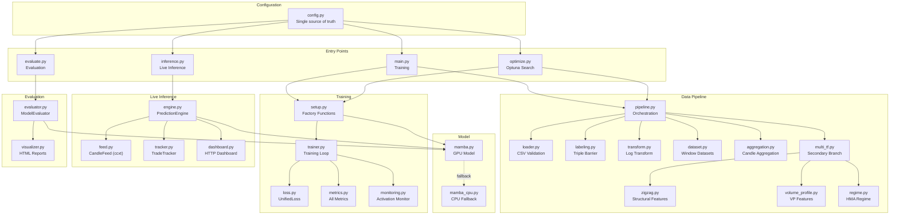
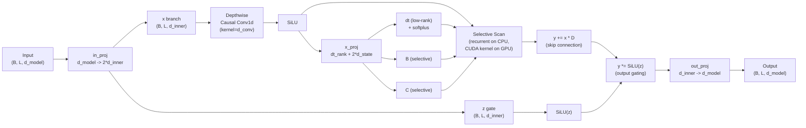
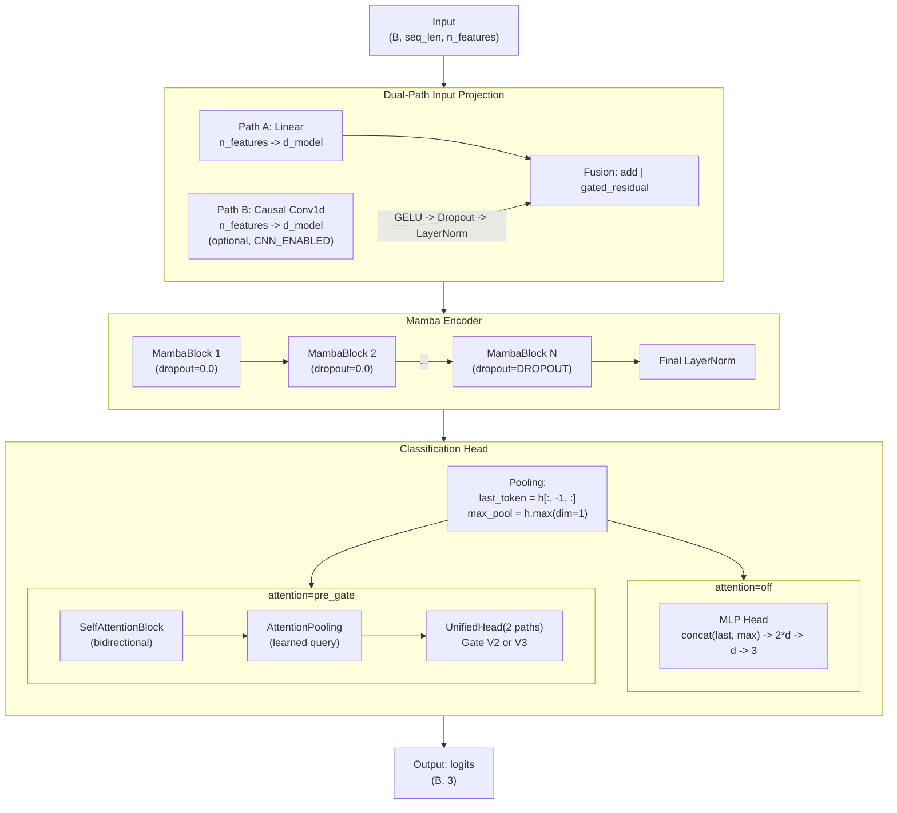
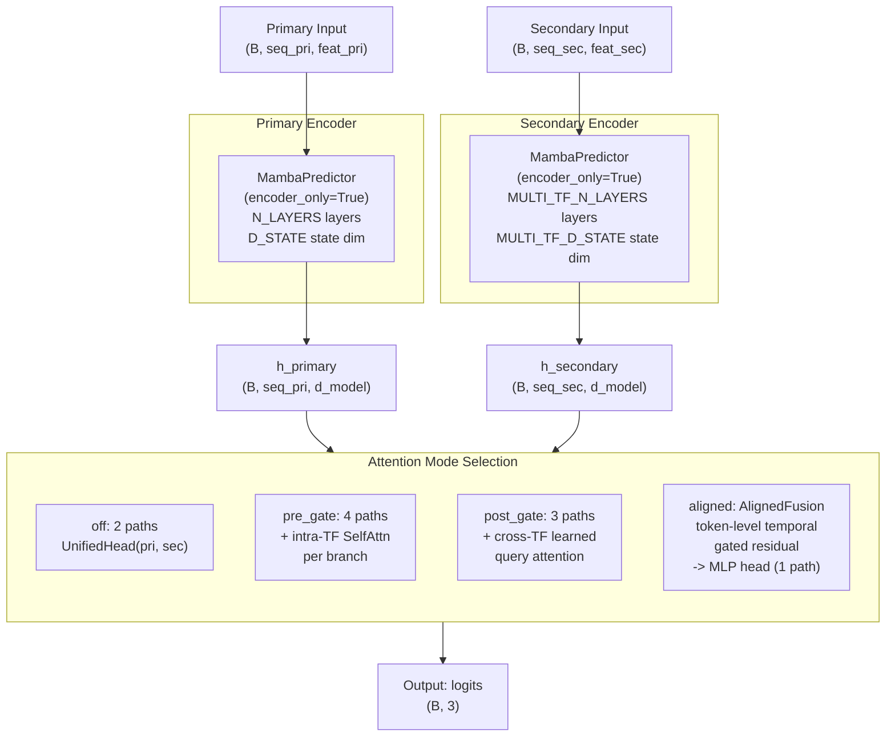
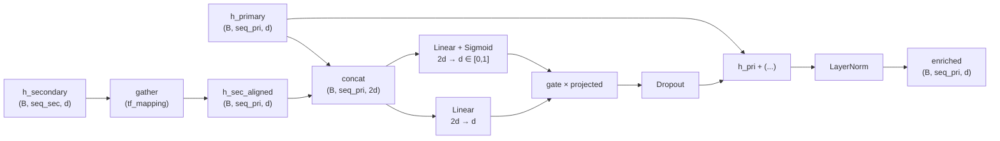
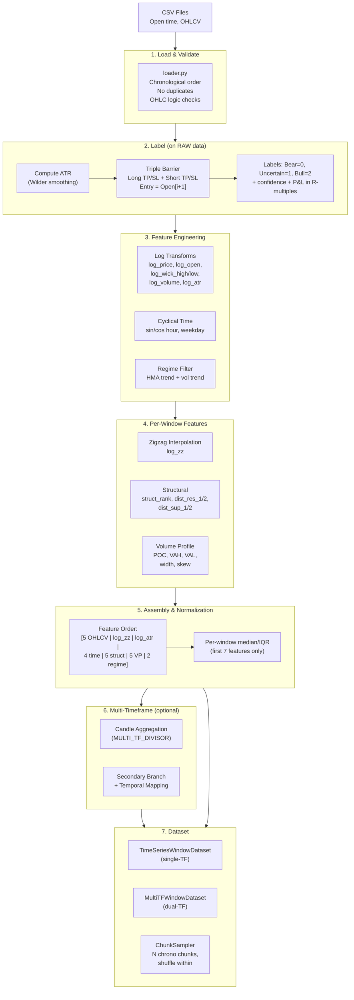
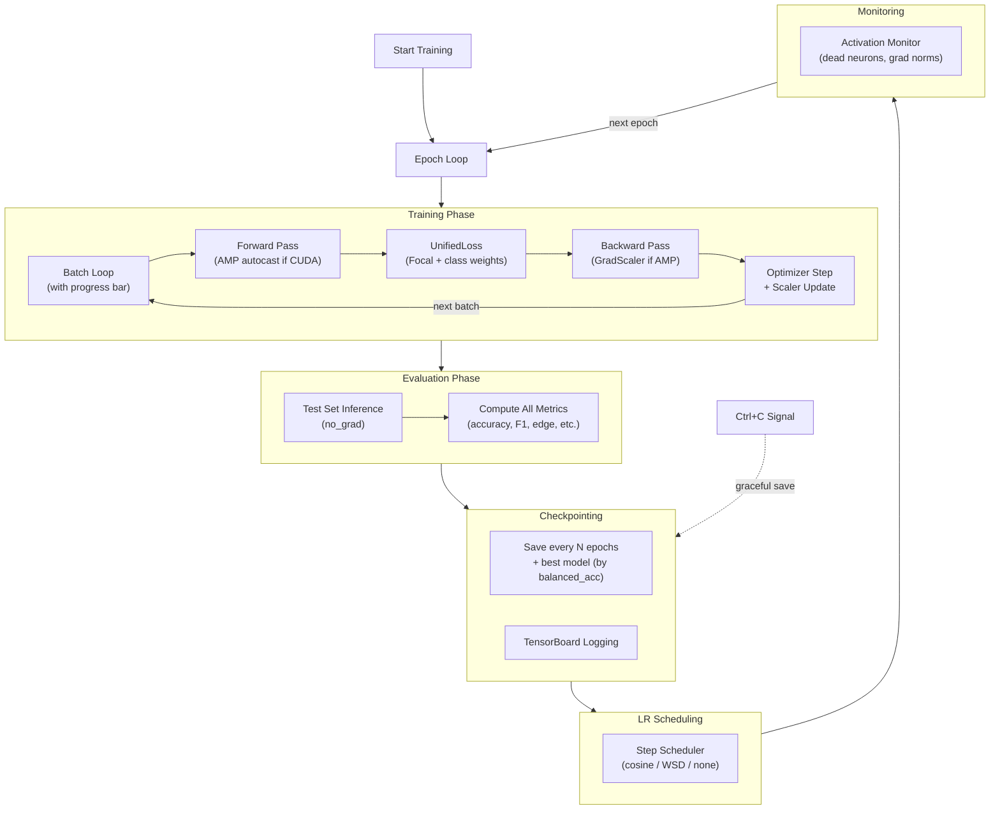
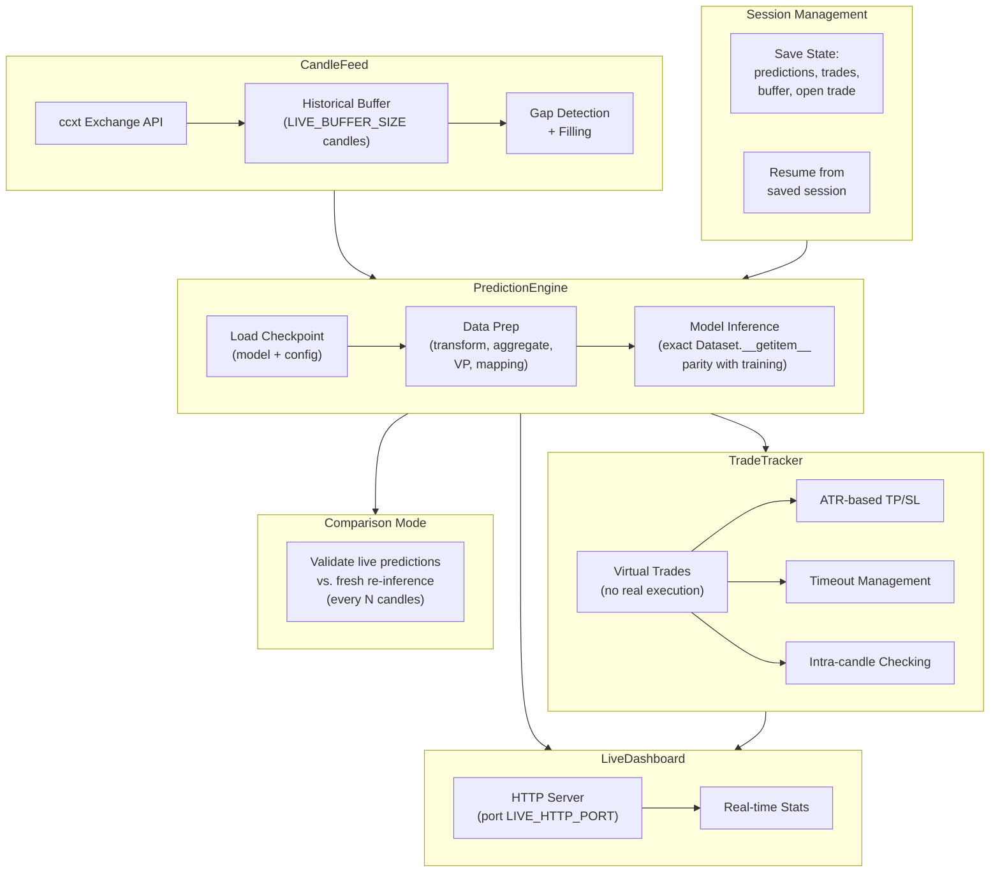

# Daikoku -- Document d'Architecture Technique

*[English version](Architecture.md)*

> Systeme de prediction pour le trading de cryptomonnaies construit sur l'architecture Mamba (Selective State Space Model).
> Classification directionnelle du marche en 3 classes : **Bull / Bear / Uncertain** via un etiquetage Triple Barrier sur des donnees de bougies OHLCV.

---

## Vue d'ensemble du pipeline d'entrainement

```
╔════════════════════════════════════════════════════════════════════╗
║                    1. PREPARATION DES DONNEES                      ║
╠════════════════════════════════════════════════════════════════════╣
║                                                                    ║
║  CSV (OHLCV)                                                       ║
║      │                                                             ║
║      ▼                                                             ║
║  Chargement & Validation                                           ║
║      │                                                             ║
║      ├──────────────────────────────┐                              ║
║      ▼                              ▼                              ║
║  Labels Triple Barrier         Transformation Log                  ║
║  (sur donnees BRUTES)          12 features globales                ║
║  Bear=0 / Uncertain=1 / Bull=2                                     ║
║                                                                    ║
╠════════════════════════════════════════════════════════════════════╣
║                         2. FENETRAGE                               ║
╠════════════════════════════════════════════════════════════════════╣
║                                                                    ║
║  Fenetres glissantes (WINDOW_SIZE bougies)                         ║
║      │                                                             ║
║      ▼                                                             ║
║  Features par fenetre (zigzag + 5 structurelles)                   ║
║      │                                                             ║
║      ▼                                                             ║
║  Normalisation Mediane/IQR (7 premieres features)                  ║
║      │                                                             ║
║      ▼                                                             ║
║  23 features par fenetre                                           ║
║                                                                    ║
╠════════════════════════════════════════════════════════════════════╣
║                 3. MULTI-TIMEFRAME (optionnel)                     ║
╠════════════════════════════════════════════════════════════════════╣
║                                                                    ║
║  ┌─────────────────────┐         ┌──────────────────────────┐      ║
║  │  Branche Primaire   │         │  Branche Secondaire      │      ║
║  │  23 feat (avec time)│         │  19 feat (sans time)     │      ║
║  │  TF original (1h)   │         │  TF agrege (4h)          │      ║
║  └────────┬────────────┘         └────────────┬─────────────┘      ║
║           │                                   │                    ║
║           ▼                                   ▼                    ║
╠════════════════════════════════════════════════════════════════════╣
║                          4. MODELE                                 ║
╠════════════════════════════════════════════════════════════════════╣
║                                                                    ║
║  ┌─────────────────────┐         ┌──────────────────────────┐      ║
║  │  Projection Entree  │         │  Projection Entree       │      ║
║  │  Linear (+CNN opt.) │         │  Linear                  │      ║
║  └────────┬────────────┘         └────────────┬─────────────┘      ║
║           │                                   │                    ║
║           ▼                                   ▼                    ║
║  ┌─────────────────────┐         ┌──────────────────────────┐      ║
║  │  Encodeur Mamba     │         │  Encodeur Mamba          │      ║
║  │  N_LAYERS blocs     │         │  MTF_N_LAYERS blocs      │      ║
║  │  (SSM causal)       │         │  (SSM causal)            │      ║
║  └────────┬────────────┘         └────────────┬─────────────┘      ║
║           │                                   │                    ║
║           └──────────────┬────────────────────┘                    ║
║                          │                                         ║
║                          ▼                                         ║
╠════════════════════════════════════════════════════════════════════╣
║                     5. FUSION & TETE                               ║
╠════════════════════════════════════════════════════════════════════╣
║                                                                    ║
║                    Mode d'attention ?                              ║
║                          │                                         ║
║       ┌──────┬───────────┼───────────┐                             ║
║       ▼      ▼           ▼           ▼                             ║
║     off   pre_gate   post_gate   aligned                           ║
║       │      │           │           │                             ║
║       ▼      ▼           ▼           ▼                             ║
║    Unified  Unified   Unified   AlignedFusion                      ║
║    Head     Head      Head      (gated residual)                   ║
║    2 paths  4 paths   3 paths   → tete MLP                         ║
║             +SelfAttn +CrossAttn                                   ║
║       │      │           │           │                             ║
║       └──────┴───────────┴───────────┘                             ║
║                          │                                         ║
║                          ▼                                         ║
║                  Logits (batch, 3)                                 ║
║                  Bear / Uncertain / Bull                           ║
║                                                                    ║
╠════════════════════════════════════════════════════════════════════╣
║                      6. ENTRAINEMENT                               ║
╠════════════════════════════════════════════════════════════════════╣
║                                                                    ║
║  Logits ──► UnifiedLoss (Focal + Class Weights) ◄── Labels         ║
║                          │                                         ║
║                          ▼                                         ║
║              AdamW + LR Scheduler (cosine/wsd)                     ║
║                          │                                         ║
║                          ▼                                         ║
║              Checkpoint (meilleure balanced_accuracy)              ║
║                                                                    ║
╚════════════════════════════════════════════════════════════════════╝
```

---

## Table des Matieres

1. [Vue d'ensemble du systeme](#vue-densemble-du-systeme)
2. [Structure du projet](#structure-du-projet)
3. [Architecture de haut niveau](#architecture-de-haut-niveau)
4. [Architecture du modele](#architecture-du-modele)
   - [Coeur SSM Mamba](#coeur-ssm-mamba)
   - [Mecanisme de repli CPU (CPU Fallback)](#mecanisme-de-repli-cpu-cpu-fallback)
   - [MambaBlock](#mambablock)
   - [MambaPredictor (Mono-Timeframe)](#mambapredictor-mono-timeframe)
   - [MultiTFMambaPredictor (Multi-Timeframe)](#multitfmambapredictor-multi-timeframe)
   - [AlignedFusion](#alignedfusion)
   - [UnifiedHead](#unifiedhead)
   - [Composants d'attention](#composants-dattention)
5. [Pipeline de donnees](#pipeline-de-donnees)
   - [Ingestion et validation CSV](#ingestion-et-validation-csv)
   - [Etiquetage Triple Barrier](#etiquetage-triple-barrier)
   - [Ingenierie des features](#ingenierie-des-features)
   - [Normalisation](#normalisation)
   - [Modes multi-timeframe](#modes-multi-timeframe)
   - [Dataset et echantillonnage](#dataset-et-echantillonnage)
6. [Systeme d'entrainement](#systeme-dentrainement)
   - [Boucle d'entrainement](#boucle-dentrainement)
   - [Entrainement en cascade (Cascade Training)](#entrainement-en-cascade-cascade-training)
   - [Fonction de perte (Loss Function)](#fonction-de-perte-loss-function)
   - [Optimiseur et planification du LR](#optimiseur-et-planification-du-lr)
   - [Metriques](#metriques)
   - [Surveillance des activations](#surveillance-des-activations)
7. [Systeme d'evaluation](#systeme-devaluation)
8. [Systeme d'inference en direct](#systeme-dinference-en-direct)
9. [Optimisation des hyperparametres](#optimisation-des-hyperparametres)
10. [Configuration](#configuration)
11. [Dependances](#dependances)

---

## Vue d'ensemble du systeme

Daikoku est un systeme de prediction concu pour les marches de cryptomonnaies. Il predit l'evolution directionnelle a court terme des prix en utilisant une approche de classification a trois classes :

| Classe | Label     | Signification                                          |
|--------|-----------|--------------------------------------------------------|
| 0      | Bear      | Le take-profit short est atteint avant le stop-loss    |
| 1      | Uncertain | Aucune barriere n'est atteinte dans l'horizon temporel |
| 2      | Bull      | Le take-profit long est atteint avant le stop-loss     |

Le systeme supporte quatre modes operationnels :

| Mode                    | Point d'entree | Description                                                                           |
|-------------------------|----------------|---------------------------------------------------------------------------------------|
| **Entrainement**        | `main.py`      | Entrainement du modele avec checkpointing, journalisation TensorBoard et AMP          |
| **Evaluation**          | `evaluate.py`  | Evaluation hors ligne avec rapports HTML et analyse des metriques                     |
| **Inference en direct** | `inference.py` | Prediction en temps reel avec flux d'echange, suivi des trades et tableau de bord web |
| **Optimisation**        | `optimize.py`  | Recherche multi-objectifs des hyperparametres via Optuna                              |

---

## Structure du projet

```
Daikoku/
├── main.py                        # Point d'entree entrainement
├── evaluate.py                    # Point d'entree evaluation
├── inference.py                   # Point d'entree inference en direct
├── optimize.py                    # Point d'entree optimisation HP Optuna
├── config.py                      # Source unique de tous les parametres de configuration
│
├── modules/
│   ├── model/
│   │   ├── mamba.py               # Modele GPU : MambaBlock, SelfAttention, AlignedFusion,
│   │   │                          #   UnifiedHead, MambaPredictor, MultiTFMambaPredictor
│   │   └── mamba_cpu.py           # Repli CPU en PyTorch pur (remplacement direct de Mamba)
│   │
│   ├── data/
│   │   ├── loader.py              # Chargement et validation CSV
│   │   ├── labeling.py            # Etiquetage Triple Barrier + labels next-close
│   │   ├── transform.py           # Transformation logarithmique, pipeline de normalisation
│   │   ├── dataset.py             # TimeSeriesWindowDataset, MultiTFWindowDataset, ChunkSampler
│   │   ├── pipeline.py            # Orchestration complete du preprocessing (off/calibration/dual)
│   │   ├── aggregation.py         # Agregation de bougies pour multi-timeframe
│   │   ├── multi_tf.py            # Construction de la branche secondaire + calcul VP
│   │   ├── zigzag.py              # Interpolation zigzag + features structurelles
│   │   ├── volume_profile.py      # Features de profil de volume (POC, VAH, VAL, width, skew)
│   │   ├── regime.py              # Filtre de regime de marche base sur HMA
│   │   └── partial_context.py     # Recalcul partiel des bougies secondaires
│   │
│   ├── training/
│   │   ├── trainer.py             # Classe Trainer avec AMP, cascade, scheduling
│   │   ├── loss.py                # UnifiedLoss (Focal + ponderation par classe)
│   │   ├── metrics.py             # Accuracy, F1, edge, highconf, margin, ecarts de surapprentissage
│   │   ├── monitoring.py          # Surveillance des activations, detection des neurones morts
│   │   └── setup.py               # Fonctions factory : create_model, create_optimizer, etc.
│   │
│   ├── inference/
│   │   ├── engine.py              # PredictionEngine (inference off/calibration/dual)
│   │   ├── feed.py                # CandleFeed (recuperation de bougies via ccxt)
│   │   ├── tracker.py             # TradeTracker (gestion de trades virtuels)
│   │   └── dashboard.py           # LiveDashboard (serveur HTTP)
│   │
│   ├── evaluation/
│   │   ├── evaluator.py           # ModelEvaluator
│   │   ├── visualizer.py          # Generation de rapports HTML (predictions sur graphique des prix)
│   │   ├── visualize_interactive.py  # Visualisation des features d'entree
│   │   ├── visualize_regime.py    # Visualisation du filtre de regime
│   │   └── visualize_zigzag.py    # Visualisation du zigzag et features structurelles
│   │
│   ├── tools/
│   │   ├── download_candles.py    # Telechargement de donnees OHLCV (ccxt)
│   │   ├── augment_data.py        # Augmentation de donnees (processus OU)
│   │   ├── visualize_augment.py   # Comparaison avant/apres augmentation
│   │   ├── analyze_labels.py      # Analyse de la distribution des labels
│   │   ├── extract_metrics.py     # Extraction et analyse des metriques TensorBoard
│   │   ├── eval_per_file.py       # Evaluation independante par fichier de donnees
│   │   ├── run_training.sh        # Lanceur d'entrainement avec protection de processus
│   │   ├── xgboost_baseline.py    # Baseline XGBoost pour comparaison
│   │   ├── mlp_cascade_baseline.py # Baseline MLP en cascade pour comparaison
│   │   └── tsne_analysis.py       # Analyse t-SNE des embeddings du modele
│   │
│   └── utils/
│       ├── logger.py              # Configuration de la journalisation
│       └── seed.py                # Graine de reproductibilite
│
└── tests/                         # Suite de tests complete
    └── data/
        └── test_Dataset.csv       # Jeu de donnees de test (commite, utilise par tous les tests)
```

---

## Architecture de haut niveau



---

## Architecture du modele

### Coeur SSM Mamba

Le modele Mamba (Selective State Space Model) implemente des equations d'etat discretisees qui traitent les sequences de maniere causale. Contrairement aux Transformers, Mamba atteint une complexite temporelle lineaire en remplacant l'attention par une formulation recurrente en espace d'etats qui filtre selectivement l'information.

**Equations d'etat discretisees :**

```
h_t = exp(dt * A) * h_{t-1} + dt * B * x_t
y_t = (h_t * C).sum(dim=-1)
```

| Parametre | Forme (Shape)               | Description                                                              |
|-----------|-----------------------------|--------------------------------------------------------------------------|
| `A`       | `(d_inner, d_state)`        | Matrice de transition d'etat, initialisee en espace logarithmique HiPPO  |
| `B`       | `(batch, seq_len, d_state)` | Projection dependante de l'entree (selective)                            |
| `C`       | `(batch, seq_len, d_state)` | Projection dependante de la sortie (selective)                           |
| `D`       | `(d_inner,)`                | Scalaire de connexion residuelle (skip connection) par dimension interne |
| `dt`      | `(batch, seq_len, d_inner)` | Pas de discretisation via projection de rang faible + softplus           |

**Flux interne d'un bloc Mamba :**



### Mecanisme de repli CPU (CPU Fallback)

Le systeme detecte automatiquement si le package CUDA `mamba_ssm` est disponible et se replie sur une implementation en PyTorch pur dans le cas contraire.

```python
# In mamba.py — detection en 4 cas :
try:
    from mamba_ssm import Mamba as _MambaGPU
    _HAS_CUDA_MAMBA = True
except ImportError:
    _HAS_CUDA_MAMBA = False

_force_cpu = getattr(config, 'DEVICE', 'auto').lower() == 'cpu'

if not _HAS_CUDA_MAMBA:
    from modules.model.mamba_cpu import Mamba       # Cas 1 : mamba_ssm non installe
elif not torch.cuda.is_available():
    from modules.model.mamba_cpu import Mamba       # Cas 2 : aucun GPU CUDA detecte
elif _force_cpu:
    from modules.model.mamba_cpu import Mamba       # Cas 3 : DEVICE='cpu' dans config
else:
    Mamba = _MambaGPU                               # Cas 4 : mode GPU normal
```

Chaque cas de repli enregistre un avertissement specifique expliquant pourquoi l'implementation CPU est utilisee.

L'implementation CPU (`mamba_cpu.py`, ~200 lignes) fournit une **interface identique** a la version CUDA. La difference principale reside dans l'operation de scan selectif :

| Aspect          | GPU (`mamba_ssm`)                                    | CPU (`mamba_cpu.py`)                                                  |
|-----------------|------------------------------------------------------|-----------------------------------------------------------------------|
| Methode de scan | Noyau CUDA fusionne (parallele)                      | Scan recurrent compile JIT `@torch.jit.script`                        |
| Performance     | Rapide (optimise pour GPU)                           | Extremement plus lent (scan sequentiel, ops tenseurs multi-threadees) |
| Interface       | `Mamba(d_model, d_state, d_conv, expand)`            | Identique                                                             |
| Formes E/S      | `(B, L, d_model) -> (B, L, d_model)`                 | Identique                                                             |
| Parametres      | A_log, D, in_proj, conv1d, x_proj, dt_proj, out_proj | Identique                                                             |
| Initialisation  | HiPPO pour A, ones pour D                            | Identique                                                             |

Le scan selectif CPU est compile JIT via `@torch.jit.script` pour la performance :

```python
@torch.jit.script
def _selective_scan_jit(x, dt, A, B, C):
    y = torch.zeros_like(x)
    h = torch.zeros(batch, d_inner, d_state, ...)
    for t in range(seq_len):
        dt_t = dt[:, t, :].unsqueeze(-1)                     # (B, d_inner, 1)
        dA = torch.exp(dt_t * A)                              # (B, d_inner, d_state)
        dB = dt_t * B[:, t, :].unsqueeze(1)                   # (B, d_inner, d_state)
        h = dA * h + dB * x[:, t, :].unsqueeze(-1)            # (B, d_inner, d_state)
        y[:, t, :] = (h * C[:, t, :].unsqueeze(1)).sum(-1)    # (B, d_inner)
    return y
```

### MambaBlock

Bloc residuel avec pre-normalisation encapsulant une couche Mamba unique :

```
Input (B, L, d_model)
  |
  +---> LayerNorm --> Mamba --> Dropout --> (+) --> Output (B, L, d_model)
  |                                         ^
  +------------- residual -----------------+
```

- LayerNorm est configurable via `MAMBA_LAYERNORM` (par defaut `nn.Identity` lorsque desactive).
- Le dropout n'est applique qu'aux **N dernieres couches** (controle par `DROPOUT_LAST_N_LAYERS`). Les couches precedentes ont `dropout=0.0`.

### MambaPredictor (Mono-Timeframe)

Le modele principal pour la prediction mono-timeframe. Peut egalement servir de backbone encodeur uniquement pour les configurations multi-timeframe.



**Trace des formes de tenseurs (attention=off, d_model=48, seq_len=120, 23 features) :**

| Etape                     | Forme (Shape)  |
|---------------------------|----------------|
| Entree                    | `(B, 120, 23)` |
| Apres projection lineaire | `(B, 120, 48)` |
| Apres N MambaBlocks       | `(B, 120, 48)` |
| last_token                | `(B, 48)`      |
| max_pool                  | `(B, 48)`      |
| concat(last, max)         | `(B, 96)`      |
| Apres tete MLP            | `(B, 3)`       |

### MultiTFMambaPredictor (Multi-Timeframe)

Architecture a double branche avec des encodeurs independants pour les timeframes primaire et secondaire.



**Details des modes d'attention :**

| Mode        | Chemins (Paths) | Tete (Head)                 | Description                                                                                                                                 |
|-------------|-----------------|-----------------------------|---------------------------------------------------------------------------------------------------------------------------------------------|
| `off`       | 2               | [UnifiedHead](#unifiedhead) | Pooling standard des deux branches                                                                                                          |
| `pre_gate`  | 4               | [UnifiedHead](#unifiedhead) | + [SelfAttention](#composants-dattention) intra-TF par branche                                                                              |
| `post_gate` | 3               | [UnifiedHead](#unifiedhead) | + Attention cross-TF par requete apprise sur les sequences concatenees                                                                      |
| `aligned`   | 1               | MLP                         | [AlignedFusion](#alignedfusion) injecte le secondaire dans le primaire via une connexion residuelle avec porte ; pas besoin de gate separee |

### AlignedFusion

Module de fusion cross-timeframe avec alignement temporel. Pour chaque token primaire, il recupere le token secondaire correspondant a l'aide d'un mapping temporel precalcule, puis applique une connexion residuelle avec porte (gated residual).



**Pseudocode :**

```
h_sec_aligned = gather(h_sec, tf_mapping)         # (B, seq_pri, d_model)
combined = concat(h_pri, h_sec_aligned)            # (B, seq_pri, 2*d_model)
gate = sigmoid(Linear(combined))                   # (B, seq_pri, d_model) in [0, 1]
projected = Linear(combined)                       # (B, seq_pri, d_model)
enriched = LayerNorm(h_pri + dropout(gate * projected))  # (B, seq_pri, d_model)
```

La porte (gate) apprend, par position et par feature, la quantite de contexte secondaire a injecter. Puisque l'information secondaire est deja fusionnee dans la representation primaire, la tete de classification n'a besoin que d'un seul chemin (pas de [Gate/UnifiedHead](#unifiedhead)), ce qui evite l'effondrement de la porte (gate collapse).

### UnifiedHead

Tete de classification configurable qui recoit une liste de tuples `(last_token, max_pool)` -- un par chemin actif.

**V2 (Gate Scalaire) :**

```
For each path i:  agg_i = last_i + max_i                     -> (B, d_model)
Context:          concat(last_0, max_0, ..., last_n, max_n)   -> (B, n_paths * 2 * d_model)
Gate:             Linear -> Tanh -> Linear -> Softmax          -> (B, n_paths) scalars
Fusion:           concat(agg_i * weight_i for all i)           -> (B, n_paths * d_model)
Classifier:       Linear -> GELU -> Dropout -> Linear          -> (B, num_classes)
```

**V3 (Gate MLP par feature) :**

```
For each path i:  proj_i = Linear(concat(last_i, max_i))      -> (B, d_model)
Gate input:       concat(proj_0, ..., proj_n)                  -> (B, n_paths * d_model)
Gate MLP:         Linear -> ReLU -> Linear -> Sigmoid          -> (B, n_paths * d_model)
Fusion:           sum(proj_i * gate_i for all i)               -> (B, d_model)
Classifier:       Linear -> GELU -> Dropout -> Linear          -> (B, num_classes)
```

La gate V3 utilise une architecture en goulot d'etranglement (bottleneck, `GATE_BOTTLENECK`) pour reduire le nombre de parametres tout en conservant la granularite par feature.

### Composants d'attention

**SelfAttentionBlock :**
- Encapsule `nn.MultiheadAttention` avec `batch_first=True`
- Bidirectionnel (pas de masque causal) -- complement de l'encodeur Mamba causal
- FlashAttention active automatiquement sur PyTorch 2.0+
- Utilise comme branche parallele a Mamba, pas comme remplacement

**AttentionPooling :**
- Pooling par requete apprise : `(B, seq_len, d_model) -> (B, d_model)`
- Vecteur de requete unique apprenable, produit scalaire avec la sequence, somme ponderee par softmax
- Utilise pour agreger les sorties de la branche attention en representations de taille fixe

---

## Pipeline de donnees



### Ingestion et validation CSV

Colonnes requises : `Open time, Open, High, Low, Close, Volume`

Regles de validation appliquees par `loader.py` :
- Ordre chronologique (horodatages strictement croissants)
- Pas de doublons d'horodatage
- Logique OHLC : `High >= max(Open, Close)`, `Low <= min(Open, Close)`, `High >= Low`
- Volume non negatif

### Etiquetage Triple Barrier

L'etiquetage est effectue sur les donnees **brutes** (non transformees) afin de preserver les relations de prix (voir [Ingenierie des features](#ingenierie-des-features) pour l'etape de transformation subsequente).

Pour chaque bougie `i` :
1. **Prix d'entree** = `Open[i+1]` (realiste : signal a `Close[i]`, execution au prochain `Open`)
2. **Scenario long** : TP = entree + `ATR_MULTIPLIER_TP` x ATR, SL = entree - `ATR_MULTIPLIER_SL` x ATR
3. **Scenario short** : TP = entree - `ATR_MULTIPLIER_TP` x ATR, SL = entree + `ATR_MULTIPLIER_SL` x ATR
4. Evaluation sur les `MAX_HORIZON` prochaines bougies pour determiner quelle barriere est atteinte en premier

| Resultat                    | Label     | Valeur |
|-----------------------------|-----------|--------|
| TP long atteint en premier  | Bull      | 2      |
| TP short atteint en premier | Bear      | 0      |
| Aucun TP atteint            | Uncertain | 1      |

Sorties supplementaires par echantillon :
- **Confiance** : `1 - (hit_candle / max_horizon)`, avec courbe `sqrt` optionnelle pour une decroissance plus douce
- **P&L en R-multiples** : suivi pour les metriques d'edge lors de l'evaluation

Le systeme supporte egalement des labels binaires next-close (cibles `close1`, `close2`, `close3`) pour une prediction directionnelle plus simple.

### Ingenierie des features

Le jeu de features contient **23 features** :

**Features globales (12, calculees dans `transform_pipeline`) :**

| Index | Feature                      | Type           | Normalisation                     |
|-------|------------------------------|----------------|-----------------------------------|
| 0     | `log_price`                  | OHLCV          | Mediane/IQR par fenetre           |
| 1     | `log_open`                   | OHLCV          | Mediane/IQR par fenetre           |
| 2     | `log_wick_high`              | OHLCV          | Mediane/IQR par fenetre           |
| 3     | `log_wick_low`               | OHLCV          | Mediane/IQR par fenetre           |
| 4     | `log_volume`                 | OHLCV          | Mediane/IQR par fenetre           |
| 5     | `log_atr`                    | Volatilite     | Mediane/IQR par fenetre           |
| 6-7   | `sin_hour`, `cos_hour`       | Temps cyclique | Aucune (borne [-1, 1])            |
| 8-9   | `sin_weekday`, `cos_weekday` | Temps cyclique | Aucune (borne [-1, 1])            |
| 10    | `regime_trend`               | Regime HMA     | Aucune (mis a l'echelle [-1, +1]) |
| 11    | `regime_voltrend`            | Regime HMA     | Aucune (mis a l'echelle [-1, +1]) |

**Features par fenetre (6, calculees dans `Dataset.__getitem__` pour eviter le look-ahead) :**

| Feature                          | Type                      | Normalisation           |
|----------------------------------|---------------------------|-------------------------|
| `log_zz` (insere a la colonne 5) | Interpolation zigzag      | Mediane/IQR par fenetre |
| `struct_rank`                    | Structurel                | Aucune                  |
| `dist_res_1`, `dist_res_2`       | Distances aux resistances | Aucune                  |
| `dist_sup_1`, `dist_sup_2`       | Distances aux supports    | Aucune                  |

**Features de profil de volume (Volume Profile, 5) :**

| Feature    | Description                                                             |
|------------|-------------------------------------------------------------------------|
| `vp_poc`   | Point de controle (Point of Control, niveau de prix a plus fort volume) |
| `vp_vah`   | Zone de valeur haute (Value Area High)                                  |
| `vp_val`   | Zone de valeur basse (Value Area Low)                                   |
| `vp_width` | Largeur de la zone de valeur                                            |
| `vp_skew`  | Asymetrie de la distribution de volume                                  |

**Ordre d'assemblage final :**

```
Branche primaire (23 features) :
  [5 OHLCV | log_zz | log_atr | 4 time | 5 struct | 5 VP  | 2 regime]
     0-4       5        6       7-10      11-15     16-20    21-22

Branche secondaire (sans features temporelles — 19) :
  [5 OHLCV | log_zz | log_atr | 5 struct | 5 VP  | 2 regime]
     0-4       5        6        7-11      12-16    17-18
```


### Normalisation

La normalisation robuste par fenetre est appliquee uniquement aux **7 premieres features** (5 OHLCV + log_zz + log_atr), en utilisant la mediane et l'IQR (ecart interquartile) pour la robustesse aux outliers :

```
median = window_feature.median()
IQR = Q75 - Q25
feature_normalized = (feature - median) / (IQR + epsilon)
```

Les features temporelles (sin/cos cycliques) et les features de regime sont deja bornees et ne sont **pas** normalisees. Les features structurelles sont relatives par construction.

### Mise a l'echelle relative a l'ATR (ATR-Relative Scaling)

Les features de distance sont exprimees en **unites d'ATR** pour assurer la comparabilite entre regimes de volatilite. Lors de l'assemblage de la fenetre, un ratio ATR/Close est calcule a partir de `log_atr` et `log_price` :

```
scaling_ratio = exp(log_atr - log_price)    # (window_size, 1)
```

Les features suivantes sont divisees par ce ratio :
- **Structurelles** colonnes 1-4 (`dist_res_1`, `dist_res_2`, `dist_sup_1`, `dist_sup_2`) — `struct_rank` (col 0) n'est PAS mise a l'echelle
- **Profil de volume** colonnes 0-3 (`vp_poc`, `vp_vah`, `vp_val`, `vp_width`) — `vp_skew` (col 4) n'est PAS mise a l'echelle

En mode `dual`, la branche secondaire reutilise le ratio ATR/Close de la **branche primaire** pour un scaling coherent entre timeframes.

### Modes multi-timeframe

| Mode          | Description                                                                                                                                                                        |
|---------------|------------------------------------------------------------------------------------------------------------------------------------------------------------------------------------|
| `off`         | Pipeline mono-timeframe standard. Utilise `TimeSeriesWindowDataset`.                                                                                                               |
| `calibration` | Agrege les bougies primaires par `MULTI_TF_DIVISOR` et execute une seule branche sur les donnees agregees. Utilise pour tester la branche secondaire de maniere isolee.            |
| `dual`        | Branches primaire + secondaire avec mapping temporel. Utilise `MultiTFWindowDataset`. Les bougies secondaires sont agregees a partir des bougies primaires via `MULTI_TF_DIVISOR`. |

En mode `dual` :
- Primaire : bougies du timeframe original (ex. 1h) — **23 features** (avec temps)
- Secondaire : bougies agregees (ex. 4h quand `MULTI_TF_DIVISOR=4`) — **19 features** (features temporelles retirees, car l'encodage cyclique intra-journalier n'a pas de sens sur des bougies agregees)
- Alignement : `"structured"` (limites horaires) ou `"unstructured"` (blocs consecutifs)
- `CROSS_TF_NORMALIZE` : normalisation optionnelle de la branche secondaire en utilisant les statistiques mediane/IQR de la branche primaire
- Mapping temporel : tenseur d'entiers `(B, seq_pri)` associant chaque position primaire a sa position secondaire correspondante
- Contexte partiel : `partial_context.py` pre-calcule les intermediaires HMA/ATR sur l'integralite des donnees agregees, permettant la simulation realiste de bougies secondaires incompletes en inference live (pas de biais look-ahead)

### Dataset et echantillonnage

**TimeSeriesWindowDataset :**
- Fenetres glissantes de `WINDOW_SIZE` bougies
- **Label = derniere bougie de la fenetre** : la fenetre `[T, T+199]` predit le futur apres la bougie `T+199` (pas `T`)
- `__getitem__` calcule les features par fenetre (zigzag, structurelles) et la normalisation pour eviter le biais de look-ahead
- Retourne `(window, label)` ou `(window, label, confidence)`

**MultiTFWindowDataset :**
- Etend TimeSeriesWindowDataset pour le fonctionnement a double branche
- Retourne `(window_pri, window_sec, tf_mapping, label)` ou avec confiance

**ChunkSampler :**
- Decoupe les indices d'entrainement en N blocs chronologiques (`SHUFFLE_CHUNKS`)
- Melange les echantillons au sein de chaque bloc
- Preserve la structure temporelle locale tout en ajoutant de la stochasticite sur l'epoch
- `SHUFFLE_CHUNKS=1` degenere en melange aleatoire complet

---

## Systeme d'entrainement

### Boucle d'entrainement



Caracteristiques principales :
- **Precision mixte AMP** : `torch.amp.autocast` + `GradScaler` (CUDA uniquement)
- **Transferts GPU non bloquants** : chevauchement des mouvements de donnees CPU/GPU
- **Gestionnaire de signal** : Ctrl+C sauvegarde gracieusement le checkpoint avant de quitter
- **Barre de progression intra-epoch** avec estimation du temps restant
- **Suivi du meilleur modele** par `balanced_accuracy` sur le jeu de test

### Entrainement en cascade (Cascade Training)

Croissance progressive des couches avec gel, active via `CASCADE_TRAINING=True` :

| Epoch | Profondeur active | Entrainement        | Gele            |
|-------|-------------------|---------------------|-----------------|
| 0     | 1                 | Couche 0 uniquement | --              |
| 1     | 2                 | Couche 1 uniquement | Couche 0        |
| 2     | 3                 | Couche 2 uniquement | Couches 0-1     |
| ...   | ...               | ...                 | ...             |
| N     | N+1               | Couche N uniquement | Couches 0 a N-1 |

Une fois toutes les couches introduites, l'ensemble des couches est degele et entraine conjointement.

### Fonction de perte (Loss Function)

**[UnifiedLoss](#fonction-de-perte-loss-function)** (dans `loss.py`) combine la modulation focale et la ponderation par classe dans un seul module :

```
loss = w_c * (1 - p_t)^gamma * (-log(p_t)) * [sample_confidence]
```

| Composant           | Controle                   | Effet                                                                  |
|---------------------|----------------------------|------------------------------------------------------------------------|
| `gamma=0`           | `FOCAL_GAMMA`              | Entropie croisee standard (pas de focal)                               |
| `gamma>0`           | `FOCAL_GAMMA`              | Sous-ponderer les exemples faciles (perte focale)                      |
| `class_weights`     | `CLASS_WEIGHT_ALPHA`       | Compenser le desequilibre de classes                                   |
| `sample_confidence` | `LABEL_CONFIDENCE_ENABLED` | Ponderation par echantillon selon la vitesse d'atteinte de la barriere |

Les poids de classe sont calcules dynamiquement a partir de la distribution des labels :

```
w_c = (N / (K * n_c))^alpha
```

Ou `N` = nombre total d'echantillons, `K` = nombre de classes, `n_c` = echantillons dans la classe c, `alpha` = `CLASS_WEIGHT_ALPHA`. Quand `alpha=0`, aucune ponderation n'est appliquee. Quand `alpha=0.5`, une frequence inverse en racine carree douce est utilisee. Quand `alpha=1.0`, la ponderation complete par frequence inverse est appliquee.

### Optimiseur et planification du LR

**AdamW** avec groupes de parametres :

| Groupe            | Parametres                                                            | Decroissance des poids (Weight Decay) |
|-------------------|-----------------------------------------------------------------------|---------------------------------------|
| Avec decroissance | Poids des projections                                                 | `WEIGHT_DECAY`                        |
| Sans decroissance | Parametres d'etat SSM (`A_log`, `D`), biais, normalisations de couche | 0.0                                   |

**Options de planification du LR :**

| Planificateur (Scheduler) | Description                                                                                                                     |
|---------------------------|---------------------------------------------------------------------------------------------------------------------------------|
| `none`                    | Taux d'apprentissage constant                                                                                                   |
| `cosine`                  | CosineAnnealingLR : le LR decroit de `LEARNING_RATE` a `LR_MIN`                                                                 |
| `wsd`                     | Warmup-Stable-Decay : montee lineaire (`LR_WARMUP_PCT`) puis plateau (`LR_STABLE_PCT`) puis decroissance lineaire vers `LR_MIN` |

### Metriques

Le systeme de metriques est organise par destination via `METRIC_REGISTRY` :

| Categorie            | Metriques                                                          |
|----------------------|--------------------------------------------------------------------|
| **Noyau**            | Accuracy, balanced accuracy, F1 macro                              |
| **Par classe**       | Precision, rappel, F1 pour chacune des classes Bear/Uncertain/Bull |
| **Confiance**        | Entropie, confiance sur les predictions correctes/incorrectes      |
| **Haute confiance**  | Accuracy directionnelle aux seuils de confiance (0.5, 0.6, 0.7)    |
| **Marge**            | Top-N% par marge (probabilite top1 - top2)                         |
| **Accuracy finale**  | Precision des predictions actionnables (directionnelles)           |
| **Edge**             | R attendu par trade (base sur le P&L)                              |
| **Surapprentissage** | Ecarts perte/accuracy train-test                                   |
| **Diagnostic**       | Normes des gradients, normes des poids par couche                  |

Pour la reference complete de tous les tags TensorBoard avec formules et usage, voir **[Metrics_TB_FR.md](Metrics_TB_FR.md)**.

### Surveillance des activations

Controles de sante periodiques des composants internes du modele :

| Verification                        | Seuil                                    | Action                                                                              |
|-------------------------------------|------------------------------------------|-------------------------------------------------------------------------------------|
| Neurones morts                      | Sortie < `MONITOR_DEAD_THRESHOLD`        | Alerte si > `MONITOR_DEAD_ALERT_PCT`% de neurones morts                             |
| Gradient qui s'evanouit (vanishing) | Norme < `MONITOR_GRAD_VANISH_THRESHOLD`  | Journalisation d'avertissement                                                      |
| Gradient qui explose (exploding)    | Norme > `MONITOR_GRAD_EXPLODE_THRESHOLD` | Journalisation d'avertissement                                                      |
| Equilibre des branches              | --                                       | Comparaison de la contribution primaire vs. secondaire (premiere et derniere epoch) |

---

## Systeme d'evaluation

`ModelEvaluator` charge un checkpoint et prepare les donnees de maniere identique au pipeline d'entrainement, garantissant une reproductibilite exacte.

| Fonctionnalite       | Description                                                                                                 |
|----------------------|-------------------------------------------------------------------------------------------------------------|
| Support des modes    | Les 3 modes MTF (off, calibration, dual)                                                                    |
| Options de decoupage | Train, test, ou toutes les donnees                                                                          |
| Sorties              | CSV de predictions, JSON de metriques, rapport HTML interactif, HTML de visualisation des features d'entree |
| Inference seule      | Peut fonctionner sans labels (aucune metrique calculee)                                                     |
| Precision            | FP16/FP32 configurable via `EVAL_MIXED_PRECISION`                                                           |

---

## Systeme d'inference en direct



Aspects cles :
- **PredictionEngine** utilise `Dataset.__getitem__()` pour l'assemblage des features, garantissant une parite exacte avec l'entrainement/evaluation
- **CandleFeed** telecharge les bougies historiques via `ccxt`, maintient un buffer glissant et comble les lacunes
- **TradeTracker** gere les trades virtuels avec take-profit/stop-loss bases sur l'ATR, logique de timeout et verification intra-bougie des TP/SL
- **LiveDashboard** execute un serveur HTTP sur un port configurable pour la surveillance en temps reel
- **Mode comparaison** valide les predictions en direct par rapport a une re-inference complete toutes les `LIVE_COMPARE_EVERY` bougies

---

## Optimisation des hyperparametres

Optimisation multi-objectifs basee sur Optuna :

| Objectif                                 | Direction |
|------------------------------------------|-----------|
| `edge_total_R` (R-multiples totaux)      | Maximiser |
| `gap_loss` (ecart de perte train-test)   | Minimiser |
| `edge_per_trade` (R par trade)           | Maximiser |

Fonctionnalites :
- Espace de recherche defini dans `config.OPTUNA_SEARCH_SPACE` avec trois formats :
  - `[v1, v2, ...]` -- `suggest_categorical`
  - `(min, max)` avec des entiers -- `suggest_int`
  - `(min, max)` avec des flottants -- `suggest_float` (echelle logarithmique)
- Stockage SQLite pour la persistance des etudes entre les executions
- Affichage du front de Pareto pour l'analyse des compromis multi-objectifs
- Tout parametre absent de l'espace de recherche utilise les valeurs par defaut de `config.py`

---

## Configuration

`config.py` est la **source unique de verite** pour tous les parametres du systeme. Il est organise en sections clairement delimitees :

| Section                  | Parametres cles                                                                                |
|--------------------------|------------------------------------------------------------------------------------------------|
| **Donnees**              | `INPUT_FILES`, `PREDICTION_TARGET`, `WINDOW_SIZE`, `TRAIN_TEST_SPLIT`, `NORMALIZE`             |
| **Triple Barrier**       | `ATR_PERIOD`, `ATR_MULTIPLIER_TP`, `ATR_MULTIPLIER_SL`, `MAX_HORIZON`                          |
| **Modele**               | `D_MODEL`, `N_LAYERS`, `D_STATE`, `D_CONV`, `EXPAND`, `MAMBA_LAYERNORM`                        |
| **Multi-TF**             | `MULTI_TF_MODE`, `MULTI_TF_DIVISOR`, `MULTI_TF_ALIGN`, `MULTI_TF_N_LAYERS`, `MULTI_TF_D_STATE` |
| **CNN**                  | `CNN_ENABLED`, `CNN_KERNEL_SIZE`, `CNN_FUSION`, `CNN_DROPOUT`                                  |
| **Attention**            | `ATTENTION_POSITION`, `ATTENTION_NUM_HEADS`, `GATE_VERSION`, `GATE_BOTTLENECK`                 |
| **Entrainement**         | `EPOCHS`, `BATCH_SIZE`, `LEARNING_RATE`, `WEIGHT_DECAY`, `DROPOUT`, `CASCADE_TRAINING`         |
| **Planification LR**     | `LR_SCHEDULER`, `LR_MIN`, `LR_WARMUP_PCT`, `LR_STABLE_PCT`                                     |
| **Perte**                | `FOCAL_GAMMA`, `CLASS_WEIGHT_ALPHA`                                                            |
| **Profil de volume**     | `VP_LOOKBACK`, `VP_BINS`, `VP_VA_PCT`                                                          |
| **Zigzag**               | `ZIGZAG_LENGTH`                                                                                |
| **Regime**               | `REGIME_LENGTH`                                                                                |
| **Confiance des labels** | `LABEL_CONFIDENCE_ENABLED`, `LABEL_CONFIDENCE_CURVE`                                           |
| **Performance**          | `MIXED_PRECISION`, `CUDNN_BENCHMARK`, `NUM_WORKERS`, `PERSISTENT_WORKERS`                      |
| **Checkpoints**          | `CHECKPOINT_DIR`, `SAVE_EVERY_N_EPOCHS`, `KEEP_LATEST`, `SAVE_ON_INTERRUPT`                    |
| **Journalisation**       | `LOG_DIR`, `LOG_LEVEL`, `TENSORBOARD_DIR`                                                      |
| **Surveillance**         | `MONITOR_ACTIVATIONS`, `MONITOR_EVERY_N_EPOCHS`, seuils                                        |
| **Augmentation**         | `AUGMENT_VARIANTS`, `AUGMENT_PCT`                                                              |
| **Evaluation**           | `EVAL_CHECKPOINT`, `EVAL_DATA_FILE`, `EVAL_SPLIT`, `EVAL_BATCH_SIZE`                           |
| **Inference en direct**  | `LIVE_EXCHANGE`, `LIVE_SYMBOL`, `LIVE_TIMEFRAME`, `LIVE_BUFFER_SIZE`, `LIVE_HTTP_PORT`         |
| **Optuna**               | `OPTUNA_SEARCH_SPACE`                                                                          |

---

## Dependances

Necessite **Python 3.11** et **CUDA 12.4** (pour l'acceleration GPU).

| Package           | Version     | Fonction                          | Requis                         |
|-------------------|-------------|-----------------------------------|--------------------------------|
| `torch`           | 2.4.1+cu124 | Framework d'apprentissage profond | Oui                            |
| `mamba-ssm`       | 2.3.0       | Noyaux CUDA Mamba                 | Non (repli CPU disponible)     |
| `causal-conv1d`   | 1.5.2       | Convolution causale rapide        | Non (requis par mamba-ssm)     |
| `numpy`           | 2.4.1       | Calcul numerique                  | Oui                            |
| `pandas`          | 3.0.0       | Chargement et manipulation        | Oui                            |
| `scikit-learn`    | 1.8.0       | Metriques (accuracy, F1, etc.)    | Oui                            |
| `scipy`           | 1.17.0      | Calculs statistiques              | Oui                            |
| `optuna`          | 4.7.0       | Optimisation des hyperparametres  | Pour `optimize.py`             |
| `ccxt`            | 4.5.36      | API d'echanges de cryptomonnaies  | Pour l'inference en direct     |
| `tensorboard`     | 2.20.0      | Visualisation de l'entrainement   | Pour la journalisation         |
| `matplotlib`      | 3.10.8      | Generation de graphiques          | Pour les rapports d'evaluation |
| `plotly`          | 6.5.2       | Visualisations HTML interactives  | Pour les rapports d'evaluation |
| `numba`           | 0.64.0      | Routines numeriques compilees JIT | Oui                            |
| `tqdm`            | 4.67.1      | Barres de progression             | Oui                            |
| `python-dateutil` | 2.9.0       | Utilitaires de parsing de dates   | Oui                            |
