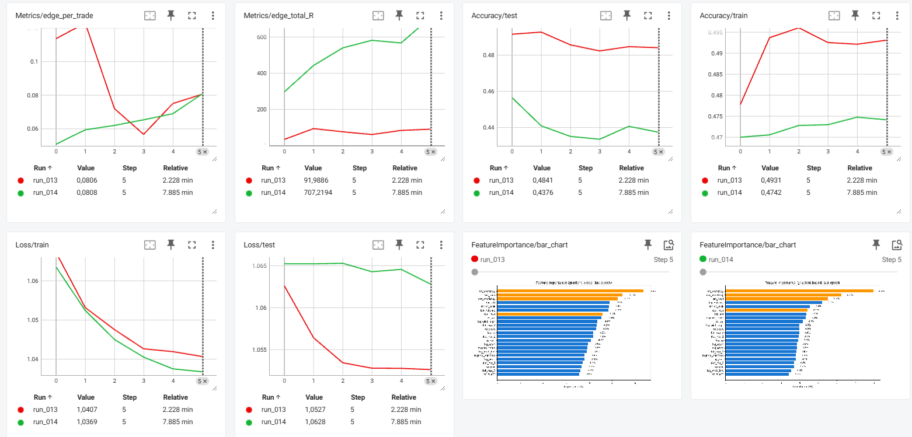
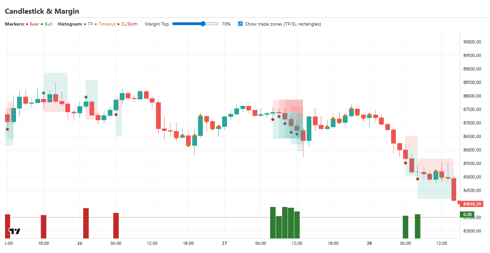
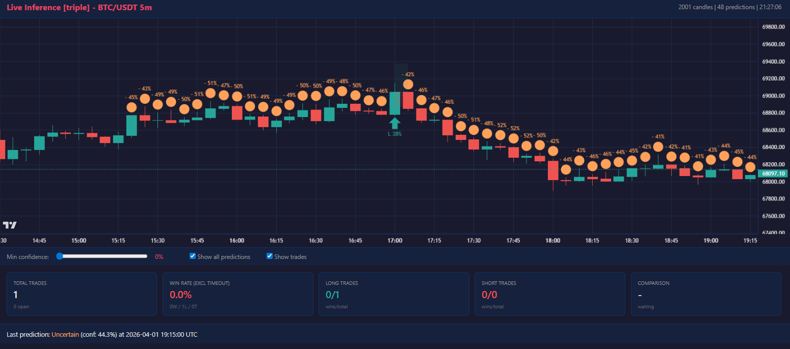

# Daikoku Guide

*[Version francaise](Guide_FR.md)*

Daikoku is a cryptocurrency trading prediction system built on the **Mamba** (Selective State Space Model) architecture. It predicts market direction -- Bull, Bear, or Uncertain -- from OHLCV candlestick data using a Triple Barrier labeling method with ATR-based take-profit and stop-loss levels.

---

## Table of Contents

1. [Prerequisites](#prerequisites)
2. [Installation](#installation)
3. [Data Preparation](#data-preparation)
4. [Configuration](#configuration)
5. [Training](#training)
6. [Hyperparameter Optimization](#hyperparameter-optimization)
7. [Evaluation](#evaluation)
8. [Live Inference](#live-inference)
9. [Tools](#tools)
10. [Project Structure](#project-structure)
11. [Tests](#tests)
12. [Troubleshooting](#troubleshooting)

---

## Prerequisites

- **Python** 3.11
- **RAM**: 16 GB minimum
- **GPU** (strongly recommended): NVIDIA CUDA-compatible GPU with at least 4 GB VRAM
- **PyTorch** 2.4.1 with CUDA 12.4 (`torch 2.4.1+cu124`)
- **CUDA toolkit** 12.4+ (optional, for GPU acceleration)

The system can run on CPU only (all features including training and tests), but training and tests will be extremely slower. A CUDA GPU is strongly recommended for any serious workload.

### Tested environment

The following versions are tested and known to work together:

| Package           | Version     | Purpose                         |
|-------------------|-------------|---------------------------------|
| `torch`           | 2.4.1+cu124 | Deep learning framework         |
| `numpy`           | 2.4.1       | Numerical computation           |
| `pandas`          | 3.0.0       | Data manipulation               |
| `scikit-learn`    | 1.8.0       | Metrics and evaluation          |
| `scipy`           | 1.17.0      | Statistical operations          |
| `optuna`          | 4.7.0       | Hyperparameter optimization     |
| `tensorboard`     | 2.20.0      | Training visualization          |
| `matplotlib`      | 3.10.8      | Plotting                        |
| `plotly`          | 6.5.2       | Interactive visualizations      |
| `numba`           | 0.64.0      | JIT-compiled numerical routines |
| `tqdm`            | 4.67.1      | Progress bars                   |
| `ccxt`            | 4.5.36      | Cryptocurrency exchange API     |
| `python-dateutil` | 2.9.0       | Date parsing utilities          |

### Optional packages (GPU acceleration)

| Package         | Version | Purpose                                 |
|-----------------|---------|-----------------------------------------|
| `mamba-ssm`     | 2.3.0   | Optimized CUDA Mamba kernels (GPU only) |
| `causal-conv1d` | 1.5.2   | Fast causal convolution (GPU only)      |

If `mamba-ssm` is not installed (e.g., CPU-only environments), Daikoku automatically falls back to a pure PyTorch implementation (`mamba_cpu.py`).

---

## Installation

### 1. Clone the repository

```bash
git clone https://github.com/yannpointud/Daikoku.git
cd Daikoku
```

### 2. Install PyTorch

Install PyTorch separately with the appropriate CUDA version for your system. Visit [pytorch.org](https://pytorch.org/get-started/locally/) for the correct command.

Tested version (CUDA 12.4):
```bash
pip install torch==2.4.1 --index-url https://download.pytorch.org/whl/cu124
```

For CPU-only:
```bash
pip install torch==2.4.1 --index-url https://download.pytorch.org/whl/cpu
```

### 3. Install dependencies

```bash
pip install -r requirements.txt
```

If you are on CPU only and `mamba-ssm` fails to install, you can skip it -- the system will use the CPU fallback automatically.

To install the optional GPU-accelerated Mamba kernels:
```bash
pip install mamba-ssm==2.3.0 causal-conv1d==1.5.2
```

### 4. Create data directories

```bash
mkdir -p data models
```

---

## Data Preparation

### CSV Format

Daikoku expects OHLCV CSV files with the following columns:

```
Open time,Open,High,Low,Close,Volume
```

Requirements:
- **Open time**: Parseable datetime string (e.g., `2023-01-01 00:00:00`)
- **Chronological order**: Rows must be sorted by time, no duplicate timestamps
- **OHLC consistency**: `High >= Low`, and `Open`/`Close` must fall within `[Low, High]`
- **Volume**: Must be >= 0

Example data:
```csv
Open time,Open,High,Low,Close,Volume
2023-01-01 00:00:00,16541.77,16553.12,16530.01,16547.23,1234.56
2023-01-01 01:00:00,16547.23,16560.00,16540.00,16555.89,987.65
2023-01-01 02:00:00,16555.89,16558.45,16545.30,16550.12,1456.78
```

### Downloading Data

Use the built-in download tool to fetch historical OHLCV data from cryptocurrency exchanges.

**Supported exchanges**: binance, bybit, bitget, kucoin

**Supported timeframes**: 5m, 15m, 30m, 1h, 2h, 4h, 1d

#### CLI mode

```bash
# Single exchange
python modules/tools/download_candles.py \
    --exchange binance \
    --pair BTC/USDT \
    --timeframe 1h \
    --start 2020-01-01 \
    --output data/BTC_1h_bin.csv

# Multiple exchanges (volume-weighted aggregation)
python modules/tools/download_candles.py \
    --exchanges binance,bybit \
    --pair ETH/USDT \
    --timeframe 1h \
    --start 2021-01-01 \
    --end 2024-12-31 \
    --output data/ETH_1h_agg.csv
```

#### Interactive mode

```bash
python modules/tools/download_candles.py
```

This will prompt you for exchange(s), pair, timeframe, date range, and output file.

#### CLI arguments

| Argument      | Description                                | Default                          |
|---------------|--------------------------------------------|----------------------------------|
| `--exchange`  | Single exchange name                       | --                               |
| `--exchanges` | Comma-separated exchange list (aggregated) | --                               |
| `--pair`      | Trading pair                               | `BTC/USDT`                       |
| `--timeframe` | Candle timeframe                           | --                               |
| `--start`     | Start date (ISO format)                    | `2019-08-01`                     |
| `--end`       | End date (ISO format)                      | now                              |
| `--output`    | Output CSV path                            | `data/download/btc_usdt_agg.csv` |
| `--limit`     | Max candles per API call                   | `1000`                           |
| `--sleep`     | Pause between API calls (seconds)          | `1.0`                            |

When multiple exchanges are selected, data is aggregated using volume-weighted averaging for OHLC prices and summed volume.

---

## Configuration

All parameters are centralized in a single file: **`config.py`**. Edit this file before training.

### Data Parameters

```python
INPUT_FILES = [
    "data/BTC_1h_agg.csv",
    # "data/ETH_1h_bin.csv",    # Uncomment to add more datasets
    # "data/SOL_1h_bin.csv",
]

PREDICTION_TARGET = "triple"    # "triple" (3-class: bull/bear/uncertain)
                                # "bull", "bear", "uncertain" (binary)
                                # "close1", "close2", "close3" (binary next-close)

WINDOW_SIZE = 120               # Number of candles per input window
TRAIN_TEST_SPLIT = 0.9          # 90% train, 10% test (chronological)
NORMALIZE = True                # Per-window median/IQR normalization
```

### Triple Barrier Labeling

Controls how candles are labeled for training. Uses ATR (Average True Range) to set dynamic TP/SL levels.

```python
ATR_PERIOD = 48           # ATR smoothing period (Wilder)
ATR_MULTIPLIER_TP = 2     # Take profit = 2 x ATR
ATR_MULTIPLIER_SL = 1     # Stop loss = 1 x ATR  (gives 2:1 R:R ratio)
MAX_HORIZON = 12          # Max candles to wait before labeling "uncertain"
```

### Model Architecture

```python
D_MODEL = 48              # Internal model dimension
N_LAYERS = 5              # Number of Mamba blocks
D_STATE = 32              # SSM state dimension
D_CONV = 4                # Convolution kernel size
EXPAND = 2                # Expansion factor for inner dimension
```

### Multi-Timeframe (MTF)

Daikoku supports a dual-branch architecture that processes two timeframes simultaneously.

```python
MULTI_TF_MODE = "dual"          # "off"         = single timeframe
                                # "calibration" = secondary TF only (for testing)
                                # "dual"        = both timeframes

MULTI_TF_DIVISOR = 4            # Aggregation factor (e.g., 1h primary -> 4h secondary)
MULTI_TF_N_LAYERS = 4           # Mamba layers for secondary branch
MULTI_TF_D_STATE = 24           # SSM state dim for secondary branch
MULTI_TF_ALIGN = "unstructured" # "structured" (hourly boundaries) / "unstructured"
CROSS_TF_NORMALIZE = True       # Normalize secondary using primary stats
```

### Attention and Gate

```python
ATTENTION_POSITION = "aligned"  # "off"       = no attention
                                # "pre_gate"  = intra-TF self-attention
                                # "post_gate" = cross-TF attention
                                # "aligned"   = cross-TF temporal alignment (recommended)

ATTENTION_NUM_HEADS = 4         # Must divide D_MODEL
GATE_VERSION = "v3"             # "v2" (scalar) / "v3" (MLP per-feature)
GATE_BOTTLENECK = 64            # Bottleneck dim for v3 gate MLP
```

### Training

```python
EPOCHS = 2
BATCH_SIZE = 128
LEARNING_RATE = 0.0001
WEIGHT_DECAY = 0.03
DROPOUT = 0.1
DROPOUT_LAST_N_LAYERS = 8      # Apply dropout only to last N layers
DROPOUT_HEAD = 0.1              # Dropout in classification head
DEVICE = "auto"                 # "auto" (GPU if available), "cuda", "cpu"
SEED = 42
SHUFFLE_TRAIN = True            # Shuffle training windows
SHUFFLE_CHUNKS = 8              # 1 = full shuffle, N>1 = chunked shuffle
```

### Learning Rate Scheduling

```python
LR_SCHEDULER = "none"          # "none" / "cosine" / "wsd" (warmup-stable-decay)
LR_MIN = 0.000005              # Minimum LR target
LR_WARMUP_PCT = 0.4            # WSD only: warmup proportion
LR_STABLE_PCT = 0.2            # WSD only: stable proportion
```

### Loss Function

```python
FOCAL_GAMMA = 0                # 0 = standard cross-entropy, >0 = focal loss
CLASS_WEIGHT_ALPHA = 0.5       # 0 = no class weighting, 0.5 = sqrt inverse freq, 1.0 = full
```

### Performance (GPU)

```python
MIXED_PRECISION = True         # AMP float16 on forward pass
CUDNN_BENCHMARK = True         # Auto-tune convolution algorithms
NUM_WORKERS = "auto"           # "auto" (adapts to CPU cores and device) or int
PERSISTENT_WORKERS = True      # Keep workers alive between epochs
NON_BLOCKING_TRANSFER = True   # Overlap CPU/GPU data transfers
```

### Feature Engineering

Daikoku computes 23 input features automatically:

| Category                     | Features                                                     |
|------------------------------|--------------------------------------------------------------|
| **OHLCV** (5)                | log_price, log_open, log_wick_high, log_wick_low, log_volume |
| **Structure** (1)            | log_zz (zigzag)                                              |
| **Volatility** (1)           | log_atr                                                      |
| **Time** (4)                 | sin_hour, cos_hour, sin_weekday, cos_weekday                 |
| **Structural** (5)           | struct_rank, dist_res_1/2, dist_sup_1/2                      |
| **Volume Profile** (5)       | VP features (POC, VAH, VAL, width, skew)                     |
| **Regime** (2)               | regime_trend, regime_voltrend                                |

---

## Training

### Basic Training

```bash
python main.py
```

This runs the complete pipeline:
1. Load and validate CSV data
2. Compute Triple Barrier labels
3. Transform features (log-scale, normalization)
4. Create train/test splits (chronological)
5. Initialize Mamba model
6. Train with checkpointing
7. Save model to `models/latest.pt`

### Resume Training

Resume from a previous checkpoint:

```bash
python main.py --resume models/latest.pt
```

### Multi-Dataset Training

Add multiple CSV files to `INPUT_FILES` in `config.py`:

```python
INPUT_FILES = [
    "data/BTC_1h_agg.csv",
    "data/ETH_1h_bin.csv",
    "data/SOL_1h_bin.csv",
]
```

Datasets are processed independently, then merged via `ConcatDataset` for training.

### Monitor Training

Training metrics are logged to TensorBoard:

```bash
tensorboard --logdir runs/
```

Open `http://localhost:6006` in your browser to view:
- Loss curves (train/test)
- Accuracy metrics
- Learning rate schedule
- Activation monitoring diagnostics
- Branch balance (for dual MTF)



For the complete list of all TensorBoard metrics (100+), see **[Metrics_TB.md](Metrics_TB.md)**.

To monitor GPU usage in real time, we recommend [nvitop](https://github.com/XuehaiPan/nvitop):

```bash
pip install nvitop
nvitop
```

### Checkpoints

Checkpoints are saved to `models/` and contain:
- `model_state_dict`: Model weights
- `optimizer_state`: Optimizer state for resumption
- `config`: All configuration parameters at training time
- `epoch`: Last completed epoch
- `metrics`: Training metrics

A copy is also placed in the TensorBoard run directory (e.g., `runs/run_001/latest.pt`).

### Interrupt Handling

Training can be safely interrupted with `Ctrl+C`. The signal handler saves a checkpoint before exiting, so no progress is lost.

---

## Hyperparameter Optimization

Daikoku uses **Optuna** for multi-objective hyperparameter optimization.

### Objectives

1. **Maximize** `edge_total_R` -- total profitability in R-multiples (quality x volume)
2. **Minimize** `gap_loss` -- difference between train and test loss (overfitting prevention)
3. **Maximize** `edge_per_trade` -- per-trade quality in R-multiples

### Define Search Space

Edit `OPTUNA_SEARCH_SPACE` in `config.py`:

```python
OPTUNA_SEARCH_SPACE = {
    'd_model': [32, 48, 64],              # Categorical: pick from list
    'n_layers': (3, 10),                   # Integer range
    'learning_rate': (0.00001, 0.001),     # Float range (log scale)
    'weight_decay': [0.001, 0.01, 0.03],  # Categorical
    'dropout': (0.05, 0.3),                # Float range (log scale)
    'window_size': (60, 200),              # Integer range
}
```

Format rules:
- **List** `[v1, v2, ...]` -- categorical choice
- **Tuple of int** `(min, max)` -- integer range
- **Tuple of float** `(min, max)` -- float range with log scale

Any parameter not listed uses its `config.py` default.

### Searchable parameters

Any UPPERCASE parameter in `config.py` can be searched — just add its lowercase name as key in `OPTUNA_SEARCH_SPACE`. Common choices:

| Category  | Parameters                                                                 |
|-----------|----------------------------------------------------------------------------|
| Model     | d_model, n_layers, d_state, d_conv, expand                                 |
| Training  | learning_rate, batch_size, weight_decay, dropout, dropout_last_n_layers    |
| Data      | window_size, atr_period, atr_multiplier_tp, atr_multiplier_sl, max_horizon |
| Loss      | focal_gamma, class_weight_alpha                                            |
| CNN       | cnn_kernel_size                                                            |
| Attention | attention_position, gate_version, gate_bottleneck                          |
| Multi-TF  | multi_tf_divisor, multi_tf_n_layers, multi_tf_d_state                      |
| Label     | label_confidence_enabled, label_confidence_curve                           |

### Run Optimization

```bash
# New study with 50 trials
python optimize.py --trials 50

# Resume an existing study
python optimize.py --trials 50 --resume

# Custom study name
python optimize.py --trials 100 --study-name my_experiment
```

### CLI Arguments

| Argument       | Description                     | Default                |
|----------------|---------------------------------|------------------------|
| `--trials`     | Number of optimization trials   | `50`                   |
| `--resume`     | Resume an existing study        | `False`                |
| `--study-name` | Study name (used for SQLite DB) | `mamba_multiobjective` |

### Results

- **SQLite database**: `optimize/<study_name>/study.db` (persistent, allows resumption)
- **Results file**: `optimize/<study_name>/results_<timestamp>.txt`
- **Detailed report**: `optimize/<study_name>/detailed_report_<timestamp>.txt`
- **TensorBoard**: Each trial logged under `runs/optuna_<NNN>/`
- **Checkpoints**: Each trial saved under `models/optuna_<NNN>/`

After optimization, the Pareto front is displayed, showing the best trade-offs between directional accuracy and robustness.

---

## Evaluation

### Basic Evaluation

```bash
python evaluate.py
```

Without arguments, all defaults come from `config.py` (checkpoint path, data file, split, device). This evaluates the default checkpoint on the test split of the configured dataset.

### Custom Evaluation

```bash
# Specific checkpoint and data file
python evaluate.py --checkpoint models/best.pt --data data/test.csv

# Evaluate on all data (train + test)
python evaluate.py --split all

# Evaluate on training set only
python evaluate.py --split train

# Force CPU
python evaluate.py --device cpu
```

### CLI Arguments

| Argument           | Description                             | Default                               |
|--------------------|-----------------------------------------|---------------------------------------|
| `--checkpoint`     | Path to model checkpoint                | `models/latest.pt`                    |
| `--data`           | Path to data CSV                        | Value from `EVAL_DATA_FILE` in config |
| `--split`          | Dataset split: `train`, `test`, `all`   | `test`                                |
| `--output`         | Output directory                        | Auto-generated                        |
| `--device`         | Device: `auto`, `cuda`, `cpu`           | `auto`                                |

### Outputs

Results are saved to `evaluation/YYYYMMDD_HHMMSS/`:

| File                      | Description                                             |
|---------------------------|---------------------------------------------------------|
| `predictions.csv`         | Per-sample predictions with probabilities               |
| `metrics.json`            | All computed metrics                                    |
| `interactive_report.html` | Interactive visualization of predictions on price chart |
| `input_features.html`     | Visualization of transformed input features             |
| `latest.pt`               | Copy of the evaluated checkpoint                        |



### Key Metrics

| Metric                | Description                                     |
|-----------------------|-------------------------------------------------|
| `accuracy`            | Overall classification accuracy                 |
| `balanced_accuracy`   | Accuracy balanced across classes                |
| `f1_macro`            | Macro-averaged F1 score                         |
| `final_accuracy`      | Directional precision (bull/bear correct rate)  |
| `edge_per_trade`      | Expected return in R-multiples per trade        |
| `gap_loss`            | Train-test loss gap (overfitting indicator)     |
| `highconf_XX_dir_acc` | Directional accuracy at confidence threshold XX |

---

## Live Inference

Live inference downloads real-time candles from an exchange, runs predictions on each new closed candle, tracks virtual trades, and serves a web dashboard.

### Basic Usage

```bash
python inference.py
```

This uses defaults from `config.py` (BTC/USDT, 15m, binance, port 7777).

### Custom Usage

```bash
# Different pair and timeframe
python inference.py --pair ETH/USDT --timeframe 1h --port 8888

# Specific checkpoint
python inference.py --checkpoint models/best.pt

# Force GPU
python inference.py --device cuda

# Fresh start (erase previous session)
python inference.py --fresh

# Different exchange
python inference.py --exchange bybit
```

### CLI Arguments

| Argument        | Description                          | Default                  |
|-----------------|--------------------------------------|--------------------------|
| `--pair`        | Trading pair                         | `BTC/USDT` (from config) |
| `--timeframe`   | Candle timeframe                     | `15m` (from config)      |
| `--checkpoint`  | Model checkpoint path                | `models/latest.pt`       |
| `--port`        | Dashboard HTTP port                  | `7777`                   |
| `--buffer-size` | Raw candle buffer size               | `2000`                   |
| `--device`      | Device: `auto`, `cuda`, `cpu`        | `auto`                   |
| `--exchange`    | Exchange name                        | `binance`                |
| `--fresh`       | Force fresh start, erase saved state | `False`                  |

### Pipeline

1. **Load model** from checkpoint
2. **Initialize tracker** with ATR-based TP/SL parameters
3. **Download candles** to fill the buffer (or resume from saved buffer)
4. **Start dashboard** on the specified HTTP port
5. **Main loop**: Wait for candle close -> run prediction -> track trade -> update dashboard

### Dashboard

Open `http://localhost:7777` (or your configured port) to view the live dashboard showing:
- Current predictions and confidence
- Open and closed virtual trades
- Win/loss statistics
- Price chart with signals



### Session Resume

When you stop inference with `Ctrl+C`, the system saves:
- `live/predictions_<PAIR>_<TF>.csv` -- all predictions
- `live/trades_<PAIR>_<TF>.csv` -- closed trades
- `live/buffer_<PAIR>_<TF>.csv` -- candle buffer
- `live/state_<PAIR>_<TF>.json` -- open trades and pending state

On restart (without `--fresh`), the session is automatically resumed:
- Previous predictions and trades are reloaded
- Missing candles since shutdown are downloaded and replayed
- Open trades are updated with any TP/SL hits that occurred while offline

### Comparison Mode

Every `LIVE_COMPARE_EVERY` candles (default: 1), the system re-runs inference on all previous predictions using the saved buffer. This verifies deterministic reproducibility -- any mismatch between live predictions and re-inference is flagged as an error on the dashboard.

---

## Tools

### Data Augmentation

Generate synthetic training data using an Ornstein-Uhlenbeck process:

```bash
python -m modules.tools.augment_data

# Custom parameters
python -m modules.tools.augment_data --file data/BTC_1h_agg.csv --variants 4
python -m modules.tools.augment_data --file data/ETH_1h_bin.csv --pct 5 --variants 6
```

Configuration in `config.py`:

```python
AUGMENT_VARIANTS = 4     # Number of augmented copies per original file
AUGMENT_PCT = 50          # Perturbation percentage
```

The augmentation modifies:
- **Open/Close**: OU process with step = max(PCT% of body, 0.1% of price), with continuity enforced
- **High/Low**: Random perturbation of wick size within PCT%
- **Volume**: Uniform random perturbation within PCT%

### Data Download

See [Data Preparation](#data-preparation) for full download documentation.

---

## Project Structure

```
Daikoku/
|-- main.py                  # Training entry point
|-- evaluate.py              # Evaluation entry point
|-- inference.py             # Live inference entry point
|-- optimize.py              # Optuna optimization entry point
|-- config.py                # All configuration parameters
|-- requirements.txt         # Python dependencies
|
|-- data/                    # Training/evaluation datasets (CSV)
|
|-- models/                  # Saved checkpoints (.pt files)
|-- runs/                    # TensorBoard log directories
|-- evaluation/              # Evaluation output reports
|-- live/                    # Live inference session files
|-- logs/                    # Application logs
|
|-- modules/
    |-- model/
    |   |-- mamba.py         # Mamba model architecture (GPU)
    |   |-- mamba_cpu.py     # Pure PyTorch CPU fallback
    |
    |-- data/
    |   |-- loader.py        # Data loading and validation
    |   |-- labeling.py      # Triple Barrier label computation
    |   |-- pipeline.py      # Data processing pipeline
    |
    |-- training/
    |   |-- trainer.py       # Training loop and evaluation
    |   |-- loss.py          # Loss functions (Focal, class-weighted CE)
    |   |-- metrics.py       # Metric computation
    |   |-- setup.py         # Model/optimizer/dataloader creation
    |
    |-- inference/
    |   |-- engine.py        # Prediction engine
    |   |-- feed.py          # Candle feed (exchange connection)
    |   |-- tracker.py       # Trade tracker (TP/SL/timeout)
    |   |-- dashboard.py     # Web dashboard server
    |
    |-- evaluation/
    |   |-- evaluator.py     # Model evaluator
    |   |-- visualizer.py    # Prediction visualizations
    |
    |-- tools/
    |   |-- download_candles.py  # OHLCV data download
    |   |-- augment_data.py      # Data augmentation
    |
    |-- utils/
        |-- logger.py        # Logging configuration
        |-- seed.py          # Random seed management
```

---

## Tests

### Running tests

```bash
python -m pytest tests/ -v
```

Most tests require the test dataset `tests/data/test_Dataset.csv`, which is included in the repository. If the file is missing, those tests will be automatically skipped.

### Test dataset

The file `tests/data/test_Dataset.csv` (~6400 rows of BTC 1h OHLCV data) is used by the test suite to:
- Train a mini-model (2 epochs) shared across tests via the `trained_checkpoint` fixture
- Validate the full pipeline (loading, labeling, transform, windowing, training, evaluation)
- Verify look-ahead bias absence, feature assembly, and normalization correctness

All test files import the dataset path from `conftest.py` via the `TEST_CSV` constant.

---

## Troubleshooting

### mamba-ssm installation fails

This is expected on CPU-only systems. The `mamba-ssm` package requires CUDA. Daikoku will automatically use the pure PyTorch fallback (`mamba_cpu.py`). You can safely ignore this error and skip installing `mamba-ssm` and `causal-conv1d`.

### CUDA out of memory

- Reduce `BATCH_SIZE` in `config.py` (try 64 or 32)
- Reduce `WINDOW_SIZE` (try 60 or 80)
- Reduce model size: lower `D_MODEL`, `N_LAYERS`, or `D_STATE`
- Set `MIXED_PRECISION = True` (default) to use float16
- Reduce `NUM_WORKERS` to free system memory

### Training is slow on CPU

- Set `NUM_WORKERS = 0` (multi-worker overhead is worse on CPU)
- Set `MIXED_PRECISION = False` (AMP has no benefit on CPU)
- Reduce `WINDOW_SIZE` and `BATCH_SIZE`
- Use smaller model dimensions

### Force CPU mode

```python
# In config.py
DEVICE = "cpu"
```

Or via CLI:
```bash
python evaluate.py --device cpu
python inference.py --device cpu
```

### Data file not found

Ensure your CSV files are in the correct path relative to the Daikoku root. The paths in `INPUT_FILES` are relative to the working directory. Run commands from the Daikoku root directory.

### Exchange API rate limits

If data download is throttled, increase the `--sleep` parameter:
```bash
python modules/tools/download_candles.py --exchange binance --timeframe 1h --start 2020-01-01 --sleep 2.0
```

### Bitget requires API keys

Bitget only returns approximately 100 recent candles without API authentication. For full historical data, you must configure API keys in the `API_KEYS` dictionary at the top of `modules/tools/download_candles.py`.

### TensorBoard not showing data

Make sure you are pointing to the correct log directory:
```bash
tensorboard --logdir runs/
```

Runs are numbered sequentially (`run_001`, `run_002`, etc.). You can view a specific run:
```bash
tensorboard --logdir runs/run_001
```

### Checkpoint compatibility

Checkpoints store the full configuration used during training. When loading a checkpoint for evaluation or inference, the model architecture is reconstructed from the saved config, not from the current `config.py`. This means you can safely change `config.py` between training runs without breaking existing checkpoints.

---

## Typical Workflow

```
1. Download data
   python modules/tools/download_candles.py --exchange binance --pair BTC/USDT --timeframe 1h --start 2020-01-01 --output data/BTC_1h_bin.csv

2. Edit config.py
   Set INPUT_FILES, PREDICTION_TARGET, model parameters, training parameters

3. Train
   python main.py

4. Monitor
   tensorboard --logdir runs/

5. Evaluate
   python evaluate.py

6. (Optional) Optimize hyperparameters
   python optimize.py --trials 50

7. Go live
   python inference.py --pair BTC/USDT --timeframe 1h
```
